# Dependency diagrams

Regenerated on 2026-10-09 from the verified readability revision, including named theorem interfaces. The 2026-10-08 correspondence proof additions remain the mathematical review baseline. See [independent review findings](CORRESPONDENCE_REVIEW.md) for statement correspondence and domain qualifications. Registry publication remains unconfirmed. Diagrams record source dependencies, separately from theorem and publication checks.

Generated by `python3 scripts/group_subprojects.py` from direct local Lean imports. Each box is a thematic subproject; an arrow **dependency → importing group** means at least one module in the importing group directly imports a module in the dependency group. Mathlib and imports within a group are omitted.

Groups can depend on each other in both directions because they collect different modules. These group relationships do not imply a cycle among individual Lean modules. The diagrams show source imports, not a chronological proof plan.

For compiled declaration types and proof/definition references, see [the formal Lean dependency graph](FORMAL_DEPENDENCIES.md) and its [offline interactive explorer](formal-dependencies.html).

Each diagram isolates one importing group so its dependencies remain readable. Together they include every cross-group dependency in [the inventory](subprojects.json). See [subprojects](SUBPROJECTS.md) for module lists and [status](STATUS.md) for proof scope.

## Complex Gaussian and Hermite analysis

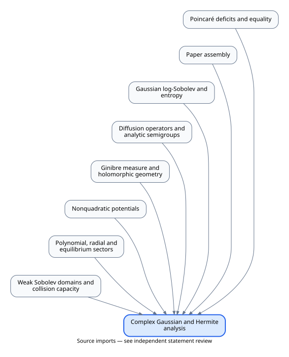

Mermaid source

```mermaid
flowchart TB
  DeficitsEquality["Poincaré deficits and equality"] --> ComplexGaussianHermite["Complex Gaussian and Hermite analysis"]
  Endgame["Paper assembly"] --> ComplexGaussianHermite["Complex Gaussian and Hermite analysis"]
  GaussianLSI["Gaussian log-Sobolev and entropy"] --> ComplexGaussianHermite["Complex Gaussian and Hermite analysis"]
  GeneratorSemigroup["Diffusion operators and analytic semigroups"] --> ComplexGaussianHermite["Complex Gaussian and Hermite analysis"]
  GinibreMeasureGeometry["Ginibre measure and holomorphic geometry"] --> ComplexGaussianHermite["Complex Gaussian and Hermite analysis"]
  NonQuadratic["Nonquadratic potentials"] --> ComplexGaussianHermite["Complex Gaussian and Hermite analysis"]
  PolynomialRadial["Polynomial, radial and equilibrium sectors"] --> ComplexGaussianHermite["Complex Gaussian and Hermite analysis"]
  WeakSobolev["Weak Sobolev domains and collision capacity"] --> ComplexGaussianHermite["Complex Gaussian and Hermite analysis"]
  DeficitsEquality ~~~ Endgame
  Endgame ~~~ GaussianLSI
  GaussianLSI ~~~ GeneratorSemigroup
  GeneratorSemigroup ~~~ GinibreMeasureGeometry
  GinibreMeasureGeometry ~~~ NonQuadratic
  NonQuadratic ~~~ PolynomialRadial
  PolynomialRadial ~~~ WeakSobolev
  classDef target fill:#dbeafe,stroke:#2563eb,stroke-width:2px,color:#172554;
  class ComplexGaussianHermite target;
```

Entry point: [ComplexGaussianHermite](GinibrePoincare/Subprojects/ComplexGaussianHermite.lean).

## Gaussian log-Sobolev and entropy

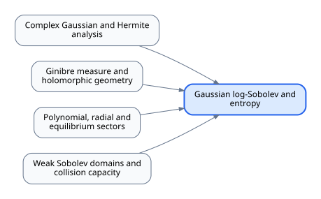

Mermaid source

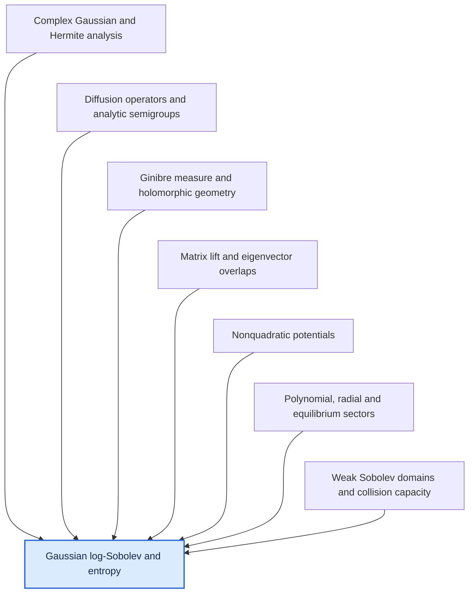
```mermaid
flowchart TB
  ComplexGaussianHermite["Complex Gaussian and Hermite analysis"] --> GaussianLSI["Gaussian log-Sobolev and entropy"]
  GeneratorSemigroup["Diffusion operators and analytic semigroups"] --> GaussianLSI["Gaussian log-Sobolev and entropy"]
  GinibreMeasureGeometry["Ginibre measure and holomorphic geometry"] --> GaussianLSI["Gaussian log-Sobolev and entropy"]
  MatrixLift["Matrix lift and eigenvector overlaps"] --> GaussianLSI["Gaussian log-Sobolev and entropy"]
  NonQuadratic["Nonquadratic potentials"] --> GaussianLSI["Gaussian log-Sobolev and entropy"]
  PolynomialRadial["Polynomial, radial and equilibrium sectors"] --> GaussianLSI["Gaussian log-Sobolev and entropy"]
  WeakSobolev["Weak Sobolev domains and collision capacity"] --> GaussianLSI["Gaussian log-Sobolev and entropy"]
  ComplexGaussianHermite ~~~ GeneratorSemigroup
  GeneratorSemigroup ~~~ GinibreMeasureGeometry
  GinibreMeasureGeometry ~~~ MatrixLift
  MatrixLift ~~~ NonQuadratic
  NonQuadratic ~~~ PolynomialRadial
  PolynomialRadial ~~~ WeakSobolev
  classDef target fill:#dbeafe,stroke:#2563eb,stroke-width:2px,color:#172554;
  class GaussianLSI target;
```

Entry point: [GaussianLSI](GinibrePoincare/Subprojects/GaussianLSI.lean).

## Ginibre measure and holomorphic geometry

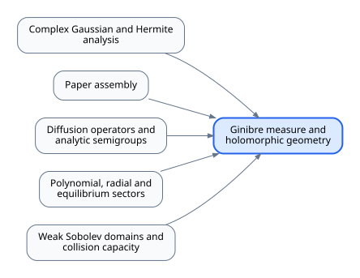

Mermaid source

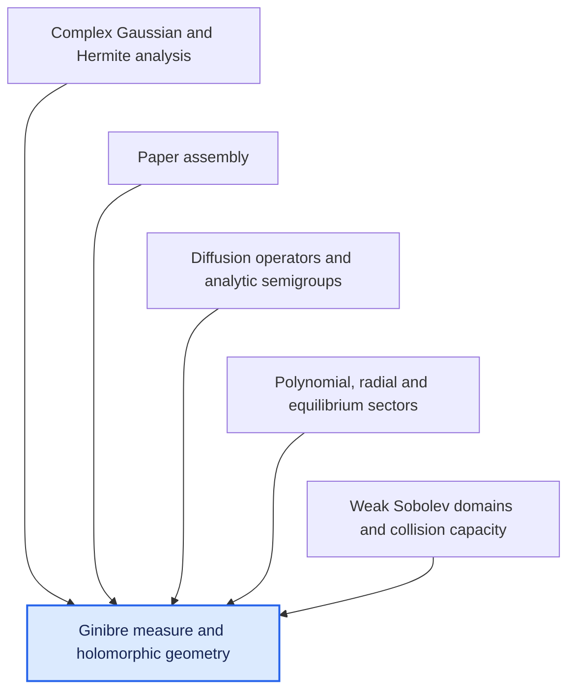
```mermaid
flowchart TB
  ComplexGaussianHermite["Complex Gaussian and Hermite analysis"] --> GinibreMeasureGeometry["Ginibre measure and holomorphic geometry"]
  Endgame["Paper assembly"] --> GinibreMeasureGeometry["Ginibre measure and holomorphic geometry"]
  GeneratorSemigroup["Diffusion operators and analytic semigroups"] --> GinibreMeasureGeometry["Ginibre measure and holomorphic geometry"]
  PolynomialRadial["Polynomial, radial and equilibrium sectors"] --> GinibreMeasureGeometry["Ginibre measure and holomorphic geometry"]
  WeakSobolev["Weak Sobolev domains and collision capacity"] --> GinibreMeasureGeometry["Ginibre measure and holomorphic geometry"]
  ComplexGaussianHermite ~~~ Endgame
  Endgame ~~~ GeneratorSemigroup
  GeneratorSemigroup ~~~ PolynomialRadial
  PolynomialRadial ~~~ WeakSobolev
  classDef target fill:#dbeafe,stroke:#2563eb,stroke-width:2px,color:#172554;
  class GinibreMeasureGeometry target;
```

Entry point: [GinibreMeasureGeometry](GinibrePoincare/Subprojects/GinibreMeasureGeometry.lean).

## Weak Sobolev domains and collision capacity

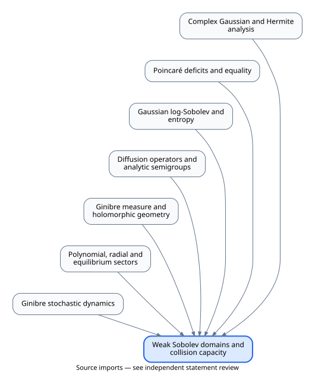

Mermaid source

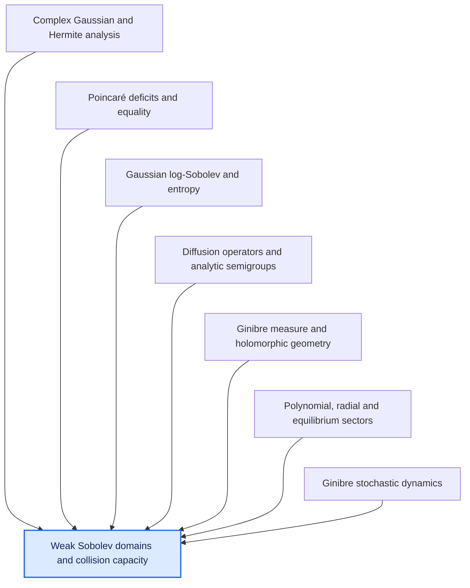
```mermaid
flowchart TB
  ComplexGaussianHermite["Complex Gaussian and Hermite analysis"] --> WeakSobolev["Weak Sobolev domains and collision capacity"]
  DeficitsEquality["Poincaré deficits and equality"] --> WeakSobolev["Weak Sobolev domains and collision capacity"]
  GaussianLSI["Gaussian log-Sobolev and entropy"] --> WeakSobolev["Weak Sobolev domains and collision capacity"]
  GeneratorSemigroup["Diffusion operators and analytic semigroups"] --> WeakSobolev["Weak Sobolev domains and collision capacity"]
  GinibreMeasureGeometry["Ginibre measure and holomorphic geometry"] --> WeakSobolev["Weak Sobolev domains and collision capacity"]
  PolynomialRadial["Polynomial, radial and equilibrium sectors"] --> WeakSobolev["Weak Sobolev domains and collision capacity"]
  StochasticDynamics["Ginibre stochastic dynamics"] --> WeakSobolev["Weak Sobolev domains and collision capacity"]
  ComplexGaussianHermite ~~~ DeficitsEquality
  DeficitsEquality ~~~ GaussianLSI
  GaussianLSI ~~~ GeneratorSemigroup
  GeneratorSemigroup ~~~ GinibreMeasureGeometry
  GinibreMeasureGeometry ~~~ PolynomialRadial
  PolynomialRadial ~~~ StochasticDynamics
  classDef target fill:#dbeafe,stroke:#2563eb,stroke-width:2px,color:#172554;
  class WeakSobolev target;
```

Entry point: [WeakSobolev](GinibrePoincare/Subprojects/WeakSobolev.lean).

## Poincaré deficits and equality

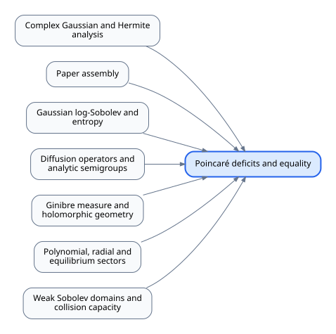

Mermaid source

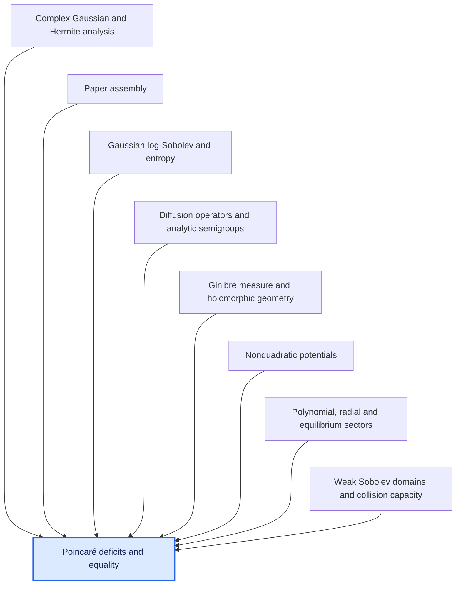
```mermaid
flowchart TB
  ComplexGaussianHermite["Complex Gaussian and Hermite analysis"] --> DeficitsEquality["Poincaré deficits and equality"]
  Endgame["Paper assembly"] --> DeficitsEquality["Poincaré deficits and equality"]
  GaussianLSI["Gaussian log-Sobolev and entropy"] --> DeficitsEquality["Poincaré deficits and equality"]
  GeneratorSemigroup["Diffusion operators and analytic semigroups"] --> DeficitsEquality["Poincaré deficits and equality"]
  GinibreMeasureGeometry["Ginibre measure and holomorphic geometry"] --> DeficitsEquality["Poincaré deficits and equality"]
  NonQuadratic["Nonquadratic potentials"] --> DeficitsEquality["Poincaré deficits and equality"]
  PolynomialRadial["Polynomial, radial and equilibrium sectors"] --> DeficitsEquality["Poincaré deficits and equality"]
  WeakSobolev["Weak Sobolev domains and collision capacity"] --> DeficitsEquality["Poincaré deficits and equality"]
  ComplexGaussianHermite ~~~ Endgame
  Endgame ~~~ GaussianLSI
  GaussianLSI ~~~ GeneratorSemigroup
  GeneratorSemigroup ~~~ GinibreMeasureGeometry
  GinibreMeasureGeometry ~~~ NonQuadratic
  NonQuadratic ~~~ PolynomialRadial
  PolynomialRadial ~~~ WeakSobolev
  classDef target fill:#dbeafe,stroke:#2563eb,stroke-width:2px,color:#172554;
  class DeficitsEquality target;
```

Entry point: [DeficitsEquality](GinibrePoincare/Subprojects/DeficitsEquality.lean).

## Polynomial, radial and equilibrium sectors

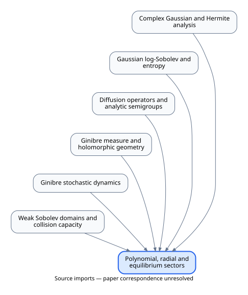

Mermaid source

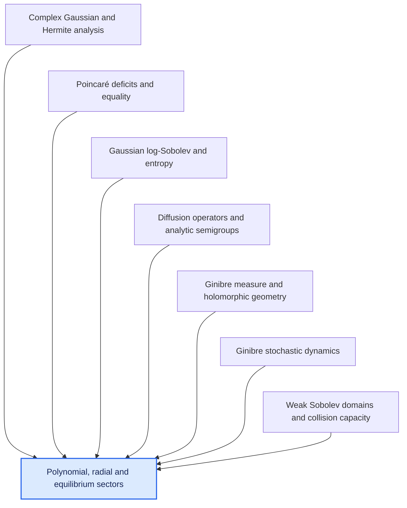
```mermaid
flowchart TB
  ComplexGaussianHermite["Complex Gaussian and Hermite analysis"] --> PolynomialRadial["Polynomial, radial and equilibrium sectors"]
  DeficitsEquality["Poincaré deficits and equality"] --> PolynomialRadial["Polynomial, radial and equilibrium sectors"]
  GaussianLSI["Gaussian log-Sobolev and entropy"] --> PolynomialRadial["Polynomial, radial and equilibrium sectors"]
  GeneratorSemigroup["Diffusion operators and analytic semigroups"] --> PolynomialRadial["Polynomial, radial and equilibrium sectors"]
  GinibreMeasureGeometry["Ginibre measure and holomorphic geometry"] --> PolynomialRadial["Polynomial, radial and equilibrium sectors"]
  StochasticDynamics["Ginibre stochastic dynamics"] --> PolynomialRadial["Polynomial, radial and equilibrium sectors"]
  WeakSobolev["Weak Sobolev domains and collision capacity"] --> PolynomialRadial["Polynomial, radial and equilibrium sectors"]
  ComplexGaussianHermite ~~~ DeficitsEquality
  DeficitsEquality ~~~ GaussianLSI
  GaussianLSI ~~~ GeneratorSemigroup
  GeneratorSemigroup ~~~ GinibreMeasureGeometry
  GinibreMeasureGeometry ~~~ StochasticDynamics
  StochasticDynamics ~~~ WeakSobolev
  classDef target fill:#dbeafe,stroke:#2563eb,stroke-width:2px,color:#172554;
  class PolynomialRadial target;
```

Entry point: [PolynomialRadial](GinibrePoincare/Subprojects/PolynomialRadial.lean).

## Diffusion operators and analytic semigroups

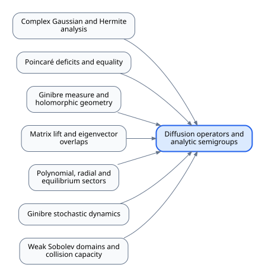

Mermaid source

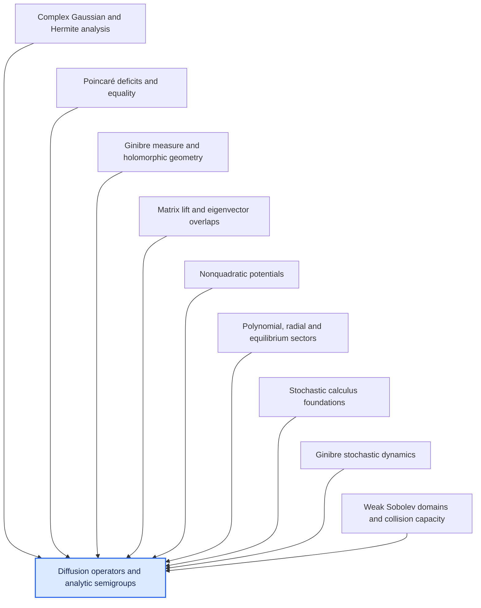
```mermaid
flowchart TB
  ComplexGaussianHermite["Complex Gaussian and Hermite analysis"] --> GeneratorSemigroup["Diffusion operators and analytic semigroups"]
  DeficitsEquality["Poincaré deficits and equality"] --> GeneratorSemigroup["Diffusion operators and analytic semigroups"]
  GinibreMeasureGeometry["Ginibre measure and holomorphic geometry"] --> GeneratorSemigroup["Diffusion operators and analytic semigroups"]
  MatrixLift["Matrix lift and eigenvector overlaps"] --> GeneratorSemigroup["Diffusion operators and analytic semigroups"]
  NonQuadratic["Nonquadratic potentials"] --> GeneratorSemigroup["Diffusion operators and analytic semigroups"]
  PolynomialRadial["Polynomial, radial and equilibrium sectors"] --> GeneratorSemigroup["Diffusion operators and analytic semigroups"]
  StochasticCalculus["Stochastic calculus foundations"] --> GeneratorSemigroup["Diffusion operators and analytic semigroups"]
  StochasticDynamics["Ginibre stochastic dynamics"] --> GeneratorSemigroup["Diffusion operators and analytic semigroups"]
  WeakSobolev["Weak Sobolev domains and collision capacity"] --> GeneratorSemigroup["Diffusion operators and analytic semigroups"]
  ComplexGaussianHermite ~~~ DeficitsEquality
  DeficitsEquality ~~~ GinibreMeasureGeometry
  GinibreMeasureGeometry ~~~ MatrixLift
  MatrixLift ~~~ NonQuadratic
  NonQuadratic ~~~ PolynomialRadial
  PolynomialRadial ~~~ StochasticCalculus
  StochasticCalculus ~~~ StochasticDynamics
  StochasticDynamics ~~~ WeakSobolev
  classDef target fill:#dbeafe,stroke:#2563eb,stroke-width:2px,color:#172554;
  class GeneratorSemigroup target;
```

Entry point: [GeneratorSemigroup](GinibrePoincare/Subprojects/GeneratorSemigroup.lean).

## Stochastic calculus foundations

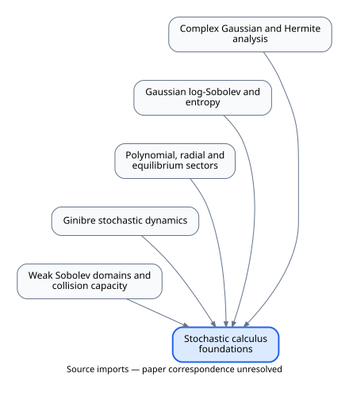

Mermaid source

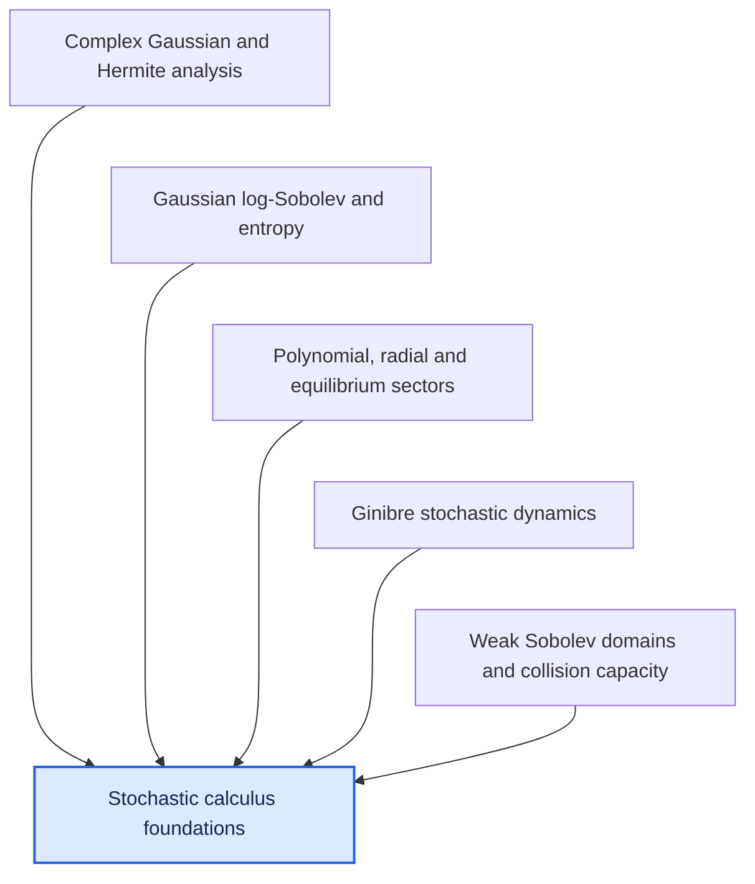
```mermaid
flowchart TB
  ComplexGaussianHermite["Complex Gaussian and Hermite analysis"] --> StochasticCalculus["Stochastic calculus foundations"]
  GaussianLSI["Gaussian log-Sobolev and entropy"] --> StochasticCalculus["Stochastic calculus foundations"]
  PolynomialRadial["Polynomial, radial and equilibrium sectors"] --> StochasticCalculus["Stochastic calculus foundations"]
  StochasticDynamics["Ginibre stochastic dynamics"] --> StochasticCalculus["Stochastic calculus foundations"]
  WeakSobolev["Weak Sobolev domains and collision capacity"] --> StochasticCalculus["Stochastic calculus foundations"]
  ComplexGaussianHermite ~~~ GaussianLSI
  GaussianLSI ~~~ PolynomialRadial
  PolynomialRadial ~~~ StochasticDynamics
  StochasticDynamics ~~~ WeakSobolev
  classDef target fill:#dbeafe,stroke:#2563eb,stroke-width:2px,color:#172554;
  class StochasticCalculus target;
```

Entry point: [StochasticCalculus](GinibrePoincare/Subprojects/StochasticCalculus.lean).

## Ginibre stochastic dynamics

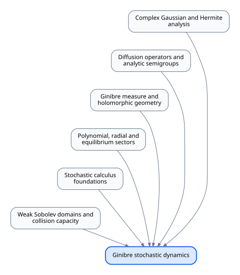

Mermaid source

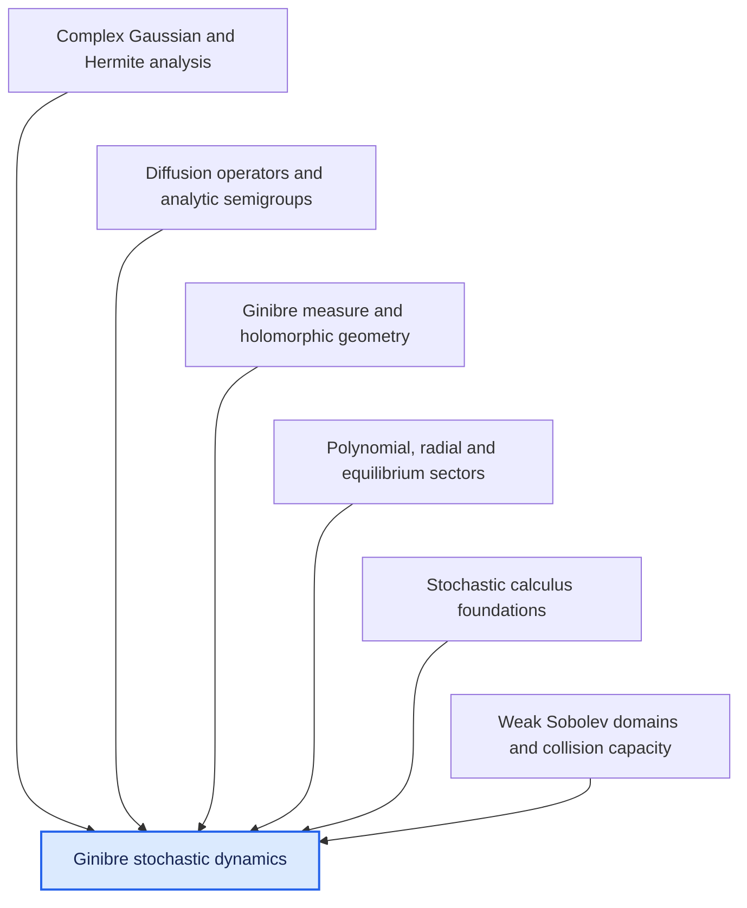
```mermaid
flowchart TB
  ComplexGaussianHermite["Complex Gaussian and Hermite analysis"] --> StochasticDynamics["Ginibre stochastic dynamics"]
  GeneratorSemigroup["Diffusion operators and analytic semigroups"] --> StochasticDynamics["Ginibre stochastic dynamics"]
  GinibreMeasureGeometry["Ginibre measure and holomorphic geometry"] --> StochasticDynamics["Ginibre stochastic dynamics"]
  PolynomialRadial["Polynomial, radial and equilibrium sectors"] --> StochasticDynamics["Ginibre stochastic dynamics"]
  StochasticCalculus["Stochastic calculus foundations"] --> StochasticDynamics["Ginibre stochastic dynamics"]
  WeakSobolev["Weak Sobolev domains and collision capacity"] --> StochasticDynamics["Ginibre stochastic dynamics"]
  ComplexGaussianHermite ~~~ GeneratorSemigroup
  GeneratorSemigroup ~~~ GinibreMeasureGeometry
  GinibreMeasureGeometry ~~~ PolynomialRadial
  PolynomialRadial ~~~ StochasticCalculus
  StochasticCalculus ~~~ WeakSobolev
  classDef target fill:#dbeafe,stroke:#2563eb,stroke-width:2px,color:#172554;
  class StochasticDynamics target;
```

Entry point: [StochasticDynamics](GinibrePoincare/Subprojects/StochasticDynamics.lean).

## Matrix lift and eigenvector overlaps

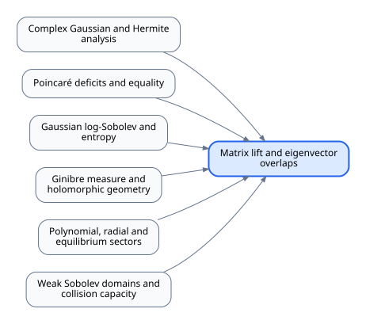

Mermaid source

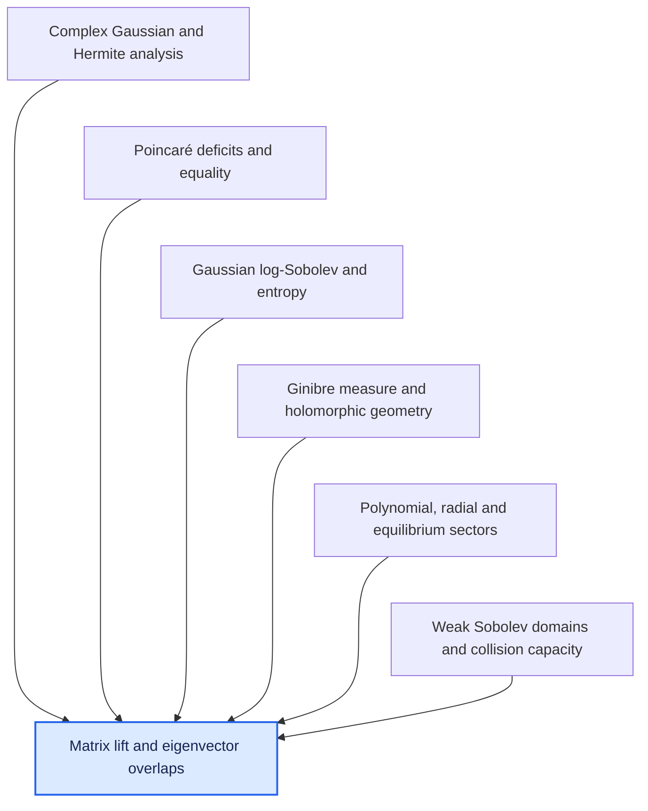
```mermaid
flowchart TB
  ComplexGaussianHermite["Complex Gaussian and Hermite analysis"] --> MatrixLift["Matrix lift and eigenvector overlaps"]
  DeficitsEquality["Poincaré deficits and equality"] --> MatrixLift["Matrix lift and eigenvector overlaps"]
  GaussianLSI["Gaussian log-Sobolev and entropy"] --> MatrixLift["Matrix lift and eigenvector overlaps"]
  GinibreMeasureGeometry["Ginibre measure and holomorphic geometry"] --> MatrixLift["Matrix lift and eigenvector overlaps"]
  PolynomialRadial["Polynomial, radial and equilibrium sectors"] --> MatrixLift["Matrix lift and eigenvector overlaps"]
  WeakSobolev["Weak Sobolev domains and collision capacity"] --> MatrixLift["Matrix lift and eigenvector overlaps"]
  ComplexGaussianHermite ~~~ DeficitsEquality
  DeficitsEquality ~~~ GaussianLSI
  GaussianLSI ~~~ GinibreMeasureGeometry
  GinibreMeasureGeometry ~~~ PolynomialRadial
  PolynomialRadial ~~~ WeakSobolev
  classDef target fill:#dbeafe,stroke:#2563eb,stroke-width:2px,color:#172554;
  class MatrixLift target;
```

Entry point: [MatrixLift](GinibrePoincare/Subprojects/MatrixLift.lean).

## Nonquadratic potentials

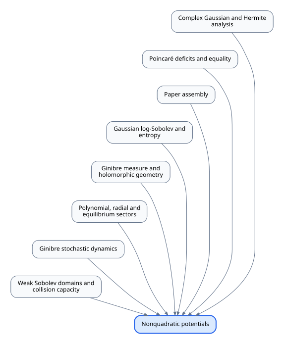

Mermaid source

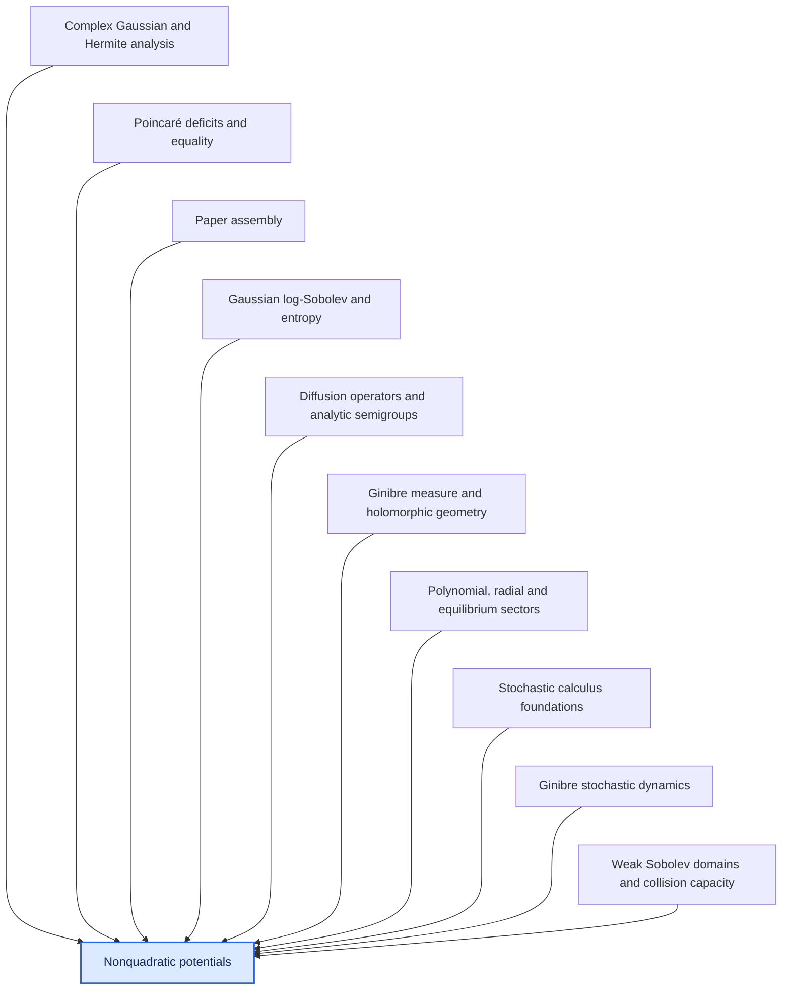
```mermaid
flowchart TB
  ComplexGaussianHermite["Complex Gaussian and Hermite analysis"] --> NonQuadratic["Nonquadratic potentials"]
  DeficitsEquality["Poincaré deficits and equality"] --> NonQuadratic["Nonquadratic potentials"]
  Endgame["Paper assembly"] --> NonQuadratic["Nonquadratic potentials"]
  GaussianLSI["Gaussian log-Sobolev and entropy"] --> NonQuadratic["Nonquadratic potentials"]
  GeneratorSemigroup["Diffusion operators and analytic semigroups"] --> NonQuadratic["Nonquadratic potentials"]
  GinibreMeasureGeometry["Ginibre measure and holomorphic geometry"] --> NonQuadratic["Nonquadratic potentials"]
  PolynomialRadial["Polynomial, radial and equilibrium sectors"] --> NonQuadratic["Nonquadratic potentials"]
  StochasticCalculus["Stochastic calculus foundations"] --> NonQuadratic["Nonquadratic potentials"]
  StochasticDynamics["Ginibre stochastic dynamics"] --> NonQuadratic["Nonquadratic potentials"]
  WeakSobolev["Weak Sobolev domains and collision capacity"] --> NonQuadratic["Nonquadratic potentials"]
  ComplexGaussianHermite ~~~ DeficitsEquality
  DeficitsEquality ~~~ Endgame
  Endgame ~~~ GaussianLSI
  GaussianLSI ~~~ GeneratorSemigroup
  GeneratorSemigroup ~~~ GinibreMeasureGeometry
  GinibreMeasureGeometry ~~~ PolynomialRadial
  PolynomialRadial ~~~ StochasticCalculus
  StochasticCalculus ~~~ StochasticDynamics
  StochasticDynamics ~~~ WeakSobolev
  classDef target fill:#dbeafe,stroke:#2563eb,stroke-width:2px,color:#172554;
  class NonQuadratic target;
```

Entry point: [NonQuadratic](GinibrePoincare/Subprojects/NonQuadratic.lean).

## Paper assembly

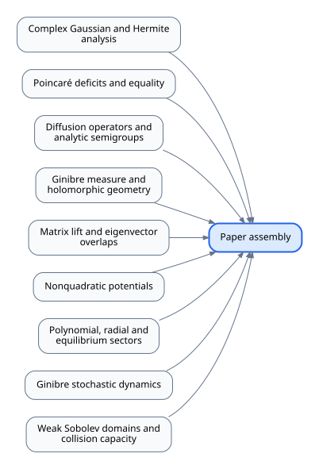

Mermaid source

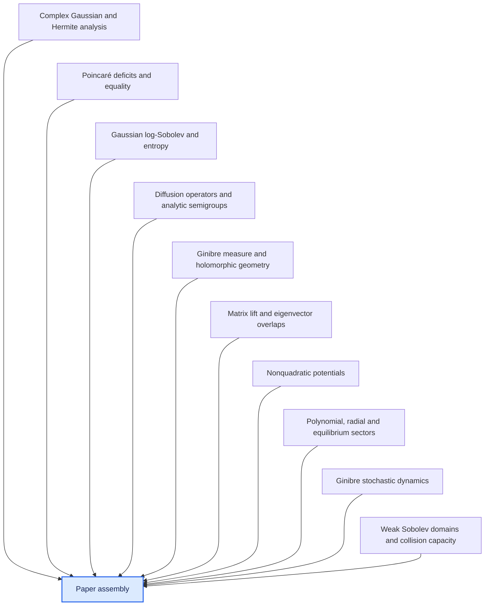
```mermaid
flowchart TB
  ComplexGaussianHermite["Complex Gaussian and Hermite analysis"] --> Endgame["Paper assembly"]
  DeficitsEquality["Poincaré deficits and equality"] --> Endgame["Paper assembly"]
  GaussianLSI["Gaussian log-Sobolev and entropy"] --> Endgame["Paper assembly"]
  GeneratorSemigroup["Diffusion operators and analytic semigroups"] --> Endgame["Paper assembly"]
  GinibreMeasureGeometry["Ginibre measure and holomorphic geometry"] --> Endgame["Paper assembly"]
  MatrixLift["Matrix lift and eigenvector overlaps"] --> Endgame["Paper assembly"]
  NonQuadratic["Nonquadratic potentials"] --> Endgame["Paper assembly"]
  PolynomialRadial["Polynomial, radial and equilibrium sectors"] --> Endgame["Paper assembly"]
  StochasticDynamics["Ginibre stochastic dynamics"] --> Endgame["Paper assembly"]
  WeakSobolev["Weak Sobolev domains and collision capacity"] --> Endgame["Paper assembly"]
  ComplexGaussianHermite ~~~ DeficitsEquality
  DeficitsEquality ~~~ GaussianLSI
  GaussianLSI ~~~ GeneratorSemigroup
  GeneratorSemigroup ~~~ GinibreMeasureGeometry
  GinibreMeasureGeometry ~~~ MatrixLift
  MatrixLift ~~~ NonQuadratic
  NonQuadratic ~~~ PolynomialRadial
  PolynomialRadial ~~~ StochasticDynamics
  StochasticDynamics ~~~ WeakSobolev
  classDef target fill:#dbeafe,stroke:#2563eb,stroke-width:2px,color:#172554;
  class Endgame target;
```

Entry point: [Endgame](GinibrePoincare/Subprojects/Endgame.lean).

