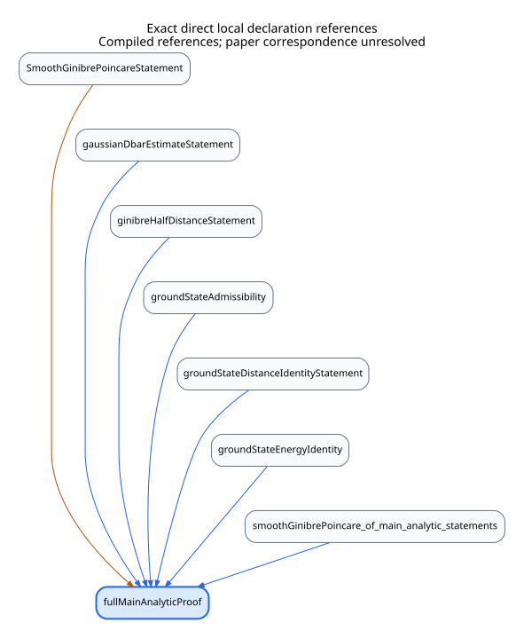
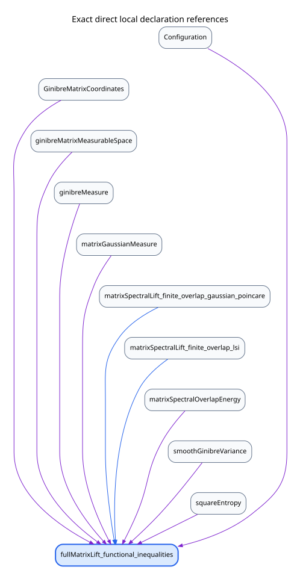
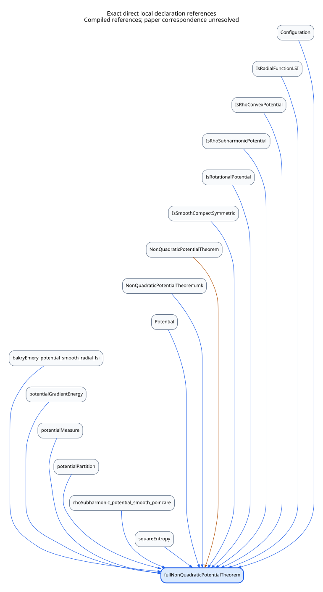
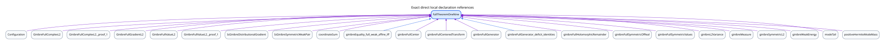
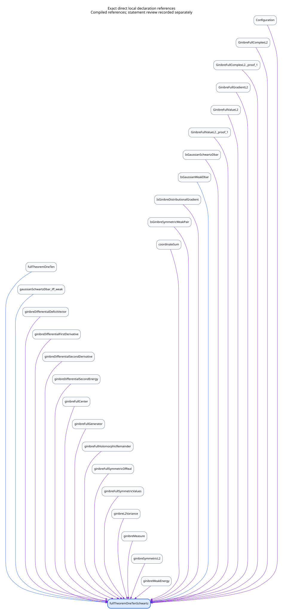
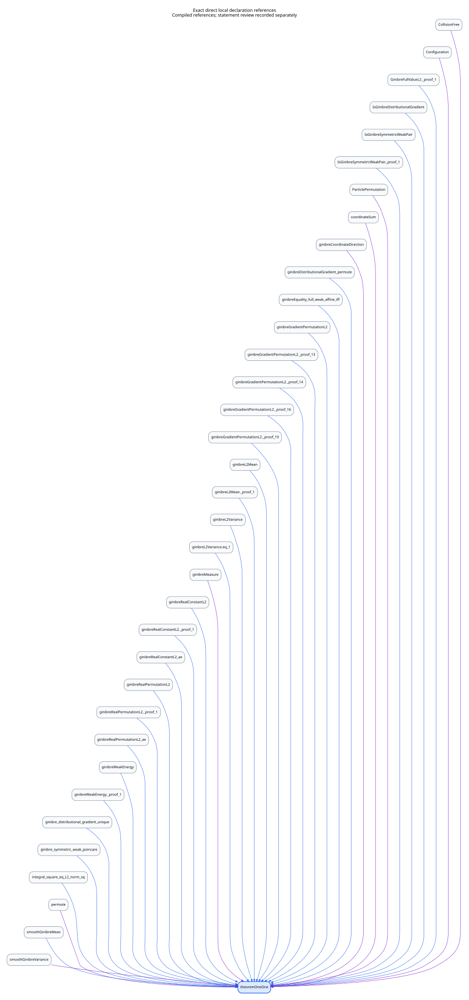

# Formal Lean dependency graph

Regenerated on 2026-10-09 after the readability revision. Mathematical correspondence
findings remain the 2026-10-08 [independent review](CORRESPONDENCE_REVIEW.md).
Independent main/auxiliary and extension/dynamics follow-ups resolve the
historical mathematical correspondence findings, including matrix H¹, pointwise
Γ₂, unrestricted operators and the classical locally Lipschitz Brascamp–Lieb
domain. Final full-tree verification passes 5,814 build jobs, 6,920 public axiom
queries and 14,592 all-local declarations; details are in STATUS.md. Registry publication
remains unconfirmed. These diagrams show compiled references, not source
correspondence or a publication receipt. The matrix preset selects the literal matrix H¹ theorem; the earlier finite-overlap
endpoint remains a separately searchable declaration.

Open [the live interactive explorer](https://djalilchafai.github.io/ginibre-poincare/formal_dependencies.html)
or download [the offline explorer](formal-dependencies.html) and open it in a browser.
The standalone HTML embeds the complete database as gzip-compressed base64
and decompresses it in the browser without removing declarations or references. When served as HTML, it works online and offline in
browsers supporting `DecompressionStream`; no external script or data fetch is
required. The full declaration JSON remains available separately.

GitHub repository file links show source previews rather than execute HTML.
The `Dependency diagrams website` workflow publishes the explorer through GitHub
Pages once Pages is configured to use **GitHub Actions** in repository settings.
It serves both `formal-dependencies.html` and `formal_dependencies.html`.
The diagrams use vertical layouts; invisible layout links only position nodes
and do not add mathematical dependencies.

It opens with the full-paper assembly overview and the original analytic proof
of Theorem 1.1. Presets also cover matrix overlaps (1.13), nonquadratic
potentials (1.14), both deficits (1.9–1.10), and the Palomar Theorem 1.1 statement. Additional presets expose the independent
spectral and Hermite–Slater inequalities, integrated Bochner–Kodaira deficit
endpoint, and Gaussian matrix Poincaré route. Their compiled-reference
independence check is [check_alternative_routes.py](scripts/check_alternative_routes.py);
proof-route correspondence and remaining work are recorded in [REPORT.md](REPORT.md#independent-proof-routes-and-domain-qualifications).
The overview links all twelve thematic groups and the numbered coverage report;
no single theorem graph represents the whole project. Search any local declaration, click a dependency to
inspect it, or use Back to retrace the exploration. The external-dependency
checkbox shows Mathlib and Lean boundary nodes. All direct references remain
listed below the diagram, including references hidden by that checkbox.

These graphs are extracted from Lean v4.35.0-rc2's compiled environment.
An arrow **dependency → dependent declaration** means the dependency's
constant occurs in the elaborated type, proof, definition body or recursor
computation rules. Orange denotes type references, blue denotes body/rule
references, and purple denotes both. References are direct syntactic uses,
not a statement that every dependency is mathematically indispensable.

The exporter explicitly loads every local proof module with `import all`,
including private declarations, and uses Lean's canonical declaration ownership.
Loading only the public root would leave some imported theorem bodies hidden.
The proof library and Solution are included; the independent Challenge and the
exporter's own declarations are excluded. Mathlib and Lean references are
recorded at the boundary; their proof dependencies are not recursively exported.

## Static statement and proof-reference diagrams

The SVGs show all **direct local** declaration references of each selected
theorem. External references are available in the interactive view and JSON.
Click through dependencies in the explorer to follow a transitive proof chain.
The complete library graph is provided as data rather than one unreadable image.

### Theorem 1.1 — original analytic proof



[Graphviz source](diagrams/formal-fullMainAnalyticProof.dot).

### Theorem 1.13 — matrix lift and overlaps



[Graphviz source](diagrams/formal-fullMatrixLift_functional_inequalities.dot).

### Theorem 1.14 — nonquadratic potentials



[Graphviz source](diagrams/formal-fullNonQuadraticPotentialTheorem.dot).

### Theorem 1.9 — both Ginibre deficits



[Graphviz source](diagrams/formal-fullTheoremOneNine.dot).

### Theorem 1.10 — ordinary differential deficits



[Graphviz source](diagrams/formal-fullTheoremOneTenSchwartz.dot).

### Palomar Theorem 1.1 — sharp inequality and affine equality



[Graphviz source](diagrams/formal-theoremOneOne.dot).

## Correspondence-completion diagrams

The fresh export also supplies direct-reference graphs for the new literal endpoints:

| Endpoint | SVG |
| --- | --- |
| Matrix H¹ / Theorem 1.13 | [Graph](diagrams/formal-correspondenceMatrix_theorem_1_13.svg) |
| Pointwise Γ₂ / Theorem 1.9 | [Graph](diagrams/formal-fullTheoremOneNinePointwiseGamma.svg) |
| Maximal number spectrum | [Graph](diagrams/formal-correspondenceOperatorNumber_spectrum_iff.svg) |
| Shifted-root Ginibre deficit | [Graph](diagrams/formal-correspondenceOperatorNumber_ginibre_shifted_root_deficit.svg) |
| Friedrichs square-root ordinary H¹ domain | [Graph](diagrams/formal-correspondenceFriedrichsSquareRoot_domain_ordinary_H1.svg) |
| Global independent CIR | [Graph](diagrams/formal-correspondence_ginibre_global_independent_CIR_equations.svg) |
| Full martingale problem | [Graph](diagrams/formal-correspondenceOperator_global_martingale_problem.svg) |
| Unrestricted ergodicity | [Graph](diagrams/formal-correspondenceOperatorEvolution_ergodic.svg) |
| Real GUE inequalities | [Graph](diagrams/formal-gueFull_C1_H1_inequalities.svg) |
| Local L² Dolbeault | [Graph](diagrams/formal-localDolbeault_locallyL2.svg) |
| Specific PI / pointwise Γ₂ equivalence | [Graph](diagrams/formal-correspondence_poincare_iff_integrated_pointwise_curvature.svg) |
| Locally Lipschitz Brascamp–Lieb | [Graph](diagrams/formal-correspondenceBrascampLieb_localLipschitz_probability_variance.svg) |

All 32 selected endpoint SVGs and twelve thematic SVGs are regenerated. Their
edges record compiled references, not proof fidelity or publication receipts.

## Complete graph data

- [Compiled declaration graph](diagrams/formal-declarations.json): every local
  declaration, its owning module and kind, and separate type/body dependency lists.
- [Complete local module import graph](diagrams/formal-module-imports.json) and
  [Graphviz DOT](diagrams/formal-module-imports.dot): all active root and library
  source files, including audits and the isolated Challenge, with direct local
  imports. Arrows point from the imported module to the importer. The generator
  verifies this source graph is acyclic. Mathlib imports are omitted here.
- [Graph summary and export digest](diagrams/formal-graph-summary.json).
- [Thematic import diagrams](DEPENDENCIES.md): the existing twelve-group views,
  which describe imports and can have cycles after grouping distinct modules.

The declaration export has 14,592 local declarations, including 12,588 theorems,
2,300 private declarations and 9,091 referenced external boundary constants.
It covers 1,721 compiled local modules. The source import graph has 1,726 nodes
and 6,443 edges; the extra source nodes are audit/compatibility/Challenge roots.
The source import graph excludes the graph-export tooling under `scripts`; the
full-project source counter includes that tooling separately.
Reference counts and selected-theorem counts are recorded in the summary JSON.

## Named result interfaces

The [reading guide](HUMAN_READABILITY.md) explains how to use these five
interfaces. Their graphs trace the adapters to the original concrete proofs:

- [Generator deficits and equality](diagrams/formal-fullTheoremOneNine_named.svg).
- [Differential deficits and weak derivatives](diagrams/formal-fullTheoremOneTen_named.svg).
- [Matrix variance and entropy bounds](diagrams/formal-fullMatrixLift_named.svg).
- [Maximal-domain Gaussian Bochner data](diagrams/formal-correspondenceOperatorNumber_has_bochner_data.svg).
- [Relative-radius stopped CIR realization](diagrams/formal-ginibreBrownianMaximalProcess_CIR_realization_named.svg).

There are now 32 selected endpoint views, alongside the twelve thematic views.
The GitHub Pages workflow deploys the online explorer from the repository;
the offline explorer in this repository contains the same generated data.

## Reproduce

Use the existing pinned Lean/Mathlib checkout. After building current sources:

```sh
LEAN_NUM_THREADS=1 lake build GinibrePoincare Solution
python3 scripts/formal_dependency_graph.py
python3 scripts/formal_dependency_graph.py --check
```

The generator synchronizes the exporter's explicit import list, runs
[scripts/ExportFormalDependencies.lean](scripts/ExportFormalDependencies.lean),
and renders JSON, Graphviz/SVG and the standalone HTML explorer. Graphviz `dot`
is required. No dependency checkout or browser service is downloaded.
`--check` compares generated views with the saved declaration export and current
source imports; it does not rerun Lean. `--from-export PATH` renders a separately
produced compiled export. The HTML embeds its declaration data and works offline.

The graph is a navigation aid, not a replacement for axiom audits or independent
review of correspondence with the paper. [STATUS.md](STATUS.md) records verified
scope, resolved correspondence findings, precise domain qualifications and unconfirmed registry publication.
