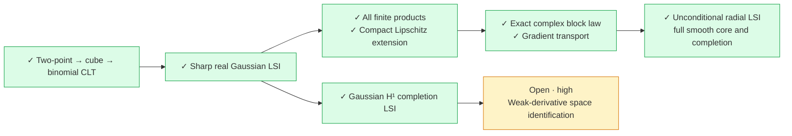

# Formalization status — asserted paper results compiled and audited (2026-10-07)

The authoritative source is [arXiv:2608.19358v2](https://arxiv.org/abs/2608.19358v2).
The asserted numbered results and the seventeen required milestones now have compiled concrete endpoints on the stated domains. Both Theorem 1.9 identities, the ordinary-distributional Theorem 1.10 endpoint, and the original analytic proof of Theorem 1.1 are exported without analytic completion hypotheses. The final global entire Vandermonde factorization, actual entire-space distance formulas and canonical minimal dbar solution are proved. Problems 1.11, 1.15 and 1.16 remain the paper's open research questions; Appendix C numerical experiments are not certified. No overall completion percentage is asserted.

The public library is organized into twelve thematic import subprojects:
[SUBPROJECTS.md](SUBPROJECTS.md) gives every file, counts, entry points and direct
dependency groups; [subprojects.json](subprojects.json) is the machine-readable
inventory. Existing module paths remain available. Every one of the 1,296
original library modules occurs in exactly one group, plus twelve generated
facades. The root imports these facades. The proof endpoint entry point is
[FullPaper.lean](GinibrePoincare/Endgame/FullPaper.lean).
The [full numbered report](FORMALIZATION_REPORT.md) inventories all 27 numbered
statements: 1.1–1.16, 2.1–2.8 and A.1–A.3.

## Palomar verification checkpoint

Lean and the existing Mathlib checkout are upgraded together to v4.35.0-rc2. The final single-thread full build, source audit, 5,079 public axiom queries, 11,112-declaration all-local audit and both root compatibility checks pass. Actual Comparator passes strict recursive statement comparison and all three kernels: con-ron, nanoda and Lean’s default kernel. The independent Challenge has exactly the user-authorized statement hole; the proof library and Solution remain hole-free and use only the three permitted standard axioms. The comparison covers full symmetric weak-H¹ Theorem 1.1 and exhaustive affine equality, not the whole paper. Offline preflight reports zero blockers and metadata passes the official v0.4 schema. No registry submission has occurred.

## Full-project dashboard

| Workstream / paper statement | Verified scope | Open work / restriction |
| --- | --- | --- |
| Complex Gaussian measure and Hermite analysis | Actual density, normalization, Gaussian polynomial integrability, orthonormal complete tensor basis, Parseval, Rodrigues and both Wirtinger lowering formulas | Ordinary Schwartz graph and actual entire-representative bridges proved |
| Ginibre measure and Vandermonde transform | Actual normalized measure, weighted L² spaces and normalized isometry | Global entire divisibility and literal representative distances proved |
| Sharp Poincaré and equality, Theorem 1.1 | Full symmetric ordinary weak-H¹ inequality and exhaustive real affine center-of-mass equality | Symmetry and stated weak domain required |
| Equilibrium factorization, Theorem 1.2 | Independence, Gaussian coordinate sum, recentered Gamma law and radial transfer | None identified in the numbered review |
| Polynomial spectrum, Theorem 1.4 / Corollary 1.5 / Remark 1.6 | Polynomial sector and properness; full-generator spectral points −2(α/n)k for every n > 0 and α > 0 | Spectrum uses the standard bounded two-sided resolvent definition for the actual unbounded graph operator |
| Curvature, Lemma 1.7 / Remark 1.8 | Actual unbounded-below pointwise/recentered curvature for n ≥ 2; mean curvature 2 | n = 1 is Gaussian |
| Hermite deficits, Theorem 1.9 | Both exact identities on the actual real symmetric generator graph; first deficit on full symmetric weak-H¹ | Generator membership for the second deficit |
| Differential deficits, Theorem 1.10 | Projected inverse square root, literal ordinary Schwartz first/second derivatives, exact second energy/integral formulas, coefficients 4/n and 8/n, affine equality | Actual real symmetric generator graph; independent weighted graph and ordinary distributional graph proved equivalent |
| Weak Sobolev domains / Appendix A.1–A.3 | Actual distributional graph, closure, uniqueness, real and complex global/collision-free core equality, positive-speed norm equivalence, zero collision capacity | No remaining A.2 endpoint gap |
| Gaussian log-Sobolev | Sharp Gaussian product, Lipschitz and finite-energy extensions; entropy integrability and closure | Stated Gaussian domains |
| Radial Ginibre log-Sobolev, Theorem 1.12 | Sharp radial inequality and weak-H¹ completion, exact paper coefficient | Radial/symmetric restriction; not a solution of Problem 1.11 |
| Full diffusion generator and analytic semigroup | Actual weak resolvent, full self-adjoint generator, strongly continuous Markov contraction semigroup, heat equation, dissipation, domain regularization, sharp decay and original-SDE identification | Actual symmetric L² space and paper speed normalization |
| Stochastic calculus and dynamics, Theorem 1.3 | Original Brownian singular SDE, adapted global collision-free paths, Itô/Dynkin identities, independent center/relative processes, CIR drivers, transition laws, Ginibre invariance, reversal and stationarity | Joint two-radius CIR realization uses n ≥ 2; deterministic initial states or the proved independent initial projections |
| Matrix lift / overlaps, Theorem 1.13 | Actual Gaussian matrix law, Schur Jacobian and spectral pushforward; variance/entropy overlap inequalities | Symmetric C¹ observable with actual L² value and finite actual overlap energy |
| Nonquadratic potentials, Theorem 1.14 | Concrete normalized law, symmetric compact-C¹ Poincaré under actual C² rotational potential/Laplacian bound; radial LSI under strong convexity | Stated potential hypotheses; bounded Lipschitz radial extension separately proved |
| Gaussian gap / Remarks 2.3–2.5 | Arbitrary Gaussian L² ordinary Schwartz graph, coefficient equivalence, compact C∞ graph density, sharp gap and exact mode equality; compact smooth equality iff zero; arbitrary ordinary closed-form solution with sharp bound; actual entire reconstruction of zero mode | Canonical minimal solution, entire kernel and literal distance correspondence proved |
| Divisibility, Lemma 2.6 | Arbitrary entire alternating functions factor globally as Vandermonde times an entire symmetric quotient, including all collision hyperplanes | None |
| Projection geometry, Lemma 2.7 / Remark 2.8 | Centered holomorphic/conjugate orthogonality; arbitrary complex L² two-projection bound and actual conjugate closed-subspace projection; arbitrary real centered L² Pythagoras and half-distance; pointwise center and Vandermonde cancellation formulas | Actual entire symmetric L² = Hdiv = closed polynomial space; literal distance infima and paper normalization proved |
| Supplementary claims / Appendix B | Nonsymmetric counterexample, linear-statistic transfer, nonholomorphic radius, polynomial-sector properness and actual Bochner/commutation formulas | Each result retains its stated domain |
| Palomar packaging | Module headers, pinned 4.35.0-rc2 dependencies, schema-valid provenance, independent weak-H¹ Theorem 1.1 statement and Solution | Full supported-toolchain build/audits and strict Comparator verification pass; public snapshot publication remains |
| Problems 1.11, 1.15, 1.16 / Appendix C | Identified as open research questions / numerical experiments | They are not asserted solved or numerically certified by Lean |

## Latest progress

Agents migrated the existing Lean/Mathlib dependencies together to v4.35.0-rc2 and repaired the changed measure, Lp, polynomial and operator APIs. The full build and both public/private axiom audits pass. Challenge is independent; Solution proves full weak-H¹ Theorem 1.1 and affine equality. Strict Comparator verification and all three kernel checks pass.

Agents completed disjoint modules for the maximal ordinary Schwartz Gaussian derivative domain, compact smooth graph density, full equality space, closed-form solvability, multivariate entire reconstruction and global division. `entire_alternating_vandermonde_factorization` proves the genuine global entire quotient across every collision. `gaussianVolumeClosedForm_canonicalSolvability` adds the unique minimal-norm solution and sharp bound.

`gaussianHolomorphicDistanceSq_eq_projectionNorm`, `vandermonde_entire_infDist`, `groundStateDistanceIdentityStatement` and `ginibreHalfDistanceStatement` identify the literal entire-representative infima with Hilbert projections, preserving the paper's normalization. `fullMainAnalyticProof` instantiates all five inputs of the original analytic proof with proved concrete facts. `fullTheoremOneTenSchwartz` exports both differential deficits with ordinary first and second distributional derivatives.

## Build and audit evidence

Fresh `LEAN_NUM_THREADS=1 make check` passed: 5,384 build jobs; 1,296 original modules assigned exactly once to twelve subprojects; all 1,308 library modules publicly imported; only the authorized independent Challenge hole; 5,079 public axiom queries; all-local audit of 11,112 declarations including private helpers. Only `propext`, `Classical.choice` and `Quot.sound` occur in the proof-library/Solution audit closure. Both root compatibility files compile. Actual Comparator passes with empty `definition_names`, so concrete definitions remain recursively compared; con-ron accepts 61,907 exported declarations, and nanoda and Lean’s default kernel also accept.

- [Full build, inventory, source and axiom audits](ginibre-upgrade-verified-check.log)
- [Import compatibility](ginibre-upgrade-compatibility.log)
- [Draft compatibility](ginibre-upgrade-drafts.log)
- [Actual strict Comparator and three kernel checks](ginibre-upgrade-comparator.log)
- [Offline Palomar structural preflight](ginibre-upgrade-preflight.log)

Compilation and axiom audits establish source coverage and soundness relative to the permitted axioms. The [numbered report](FORMALIZATION_REPORT.md) separately records statement correspondence and natural domain qualifications.

## Lean source counts

Refreshed with `python3 scripts/count_lean_sources.py`.

| Source scope | Files/modules | Physical lines |
| --- | ---: | ---: |
| Active project Lean sources, including roots and generated facades | 1,315 | 142,364 |
| Transitively imported Mathlib | 3,794 | 1,251,826 |
| Project plus imported Mathlib | 5,109 | 1,394,190 |

Comments and blank lines are included. Imported Mathlib modules are counted
once in full, using only `.lake/packages/mathlib`. Archives, Lean core and other
dependencies are excluded. This is module-level usage, not declaration-level
proof dependency usage. The pure inventory excludes generated facades and root
audit/compatibility files; its totals therefore differ from the full source count.

## Open work and next step

No previously listed formalization obligation remains open for the asserted results. Problems 1.11, 1.15 and 1.16 are unsolved research questions in the paper, and Appendix C experiments are outside theorem certification. Alternative proof routes are not each independently exported. The next step is to publish the final committed snapshot to a public GitHub repository and submit its exact commit SHA to Palomar, if requested. No additional analytic completion hypothesis is required.

Git was reinitialized on `main` at the user’s request. The previous Git metadata is preserved at `/tmp/ginibre-git-before-reinit-2026-10-07/repository.git`. The fresh initial commit includes the source, dependency manifest, reports and verification evidence. No remote publication or registry submission has occurred. Historical checkpoints below describe earlier states and are superseded by this dashboard.

## Historical checkpoints (superseded)

# Formalization status — verified 2026-10-03

The concrete Theorem 1.9 development builds and passes its axiom audit.
The full paper formalization is **not complete**. The user expanded the scope
on 2026-10-02 to include nonquadratic potentials and matrix lifts, and explicitly
requested agents. Earlier exclusions recorded below are historical and superseded.
The old admitted and vacuous completion instances have been removed; exact open
analytic targets are not represented as proved theorems.

## Full-project dashboard

Snapshot: 2026-10-03. **Full formalization remains an ongoing, incomplete objective.**
Every paper goal, including nonquadratic potentials and matrix-lift/eigenvector-overlap
results, is now in scope.

| Workstream | Status | Verified scope / remaining work |
| --- | --- | --- |
| Ginibre measure and Gaussian/Hermite infrastructure | Verified | Normalization, Vandermonde isometry, Hermite completeness and Parseval. |
| Equilibrium factorization and radial laws | Verified | Independence, Gaussian sum, recentered Gamma law and independent-Gamma radial transfer. |
| Theorem 1.9: both deficit identities | Verified on full real generator graph | Both exact deficit identities; graph membership supplies the actual weak gradient and convergent Hermite tail. The first deficit also holds on every symmetric ordinary weak-H¹ pair. |
| Hermite–Laguerre polynomial sector | Verified sector | Complete normalized Hilbert basis, exact self-adjoint closed generator, semigroup infinitesimal identification, and one-dimensional constant kernel. Exact full diffusion semigroup and generator-domain restriction on the entire closed sector. |
| Sharp Gaussian and radial log-Sobolev inequalities | Verified on stated domains | Gaussian products and Lipschitz extension; sharp radial weak-H¹ LSI and entropy integrability with coefficient 1/n. |
| Weak gradients and Sobolev closure | Verified | Uniqueness, closability, independent closed weak graph, nonlinear chain rule, radial domain equality and symmetric collision-free core approximation. |
| Full symmetric Poincaré domain | Verified | Sharp inequality for every symmetric weak-H¹ pair; full smooth compact symmetric class, including support meeting collisions. |
| Equality classification | Verified on full weak domain | Exact sharp equality iff the actual L² observable is a real constant plus twice the real part of a complex multiple of the coordinate sum. No smoothness, polynomial representation or spectral-tail assumption is required. |
| Full diffusion operator and semigroup | Verified | Concrete full symmetric complex weak resolvent and strongly continuous self-adjoint contraction semigroup; exact infinitesimal generator, weak variational identification, smooth differential-generator identification, constant kernel, conserved mean, sharp exp(−2t) centered L² decay and equilibrium convergence. Actual positivity, real order and bounded-interval preservation, and positive-time generator-domain regularization are proved. Actual all-L² positive-time differentiability, weak heat equation, exact energy dissipation, L¹ contraction and paper-speed normalization are proved. Genuine original-SDE state transition kernels, their zero-time identity, Chapman–Kolmogorov law and tested-past Markov identity are proved. The actual normalized stochastic Bochner resolvent equals the analytic unit resolvent on every symmetric L² value. The literal original Brownian stochastic transitions equal the analytic paper-speed semigroup for every nonnegative speed and horizon, including n=1 and zero speed. Genuine L² Chapman–Kolmogorov and particle-label covariance are derived internally. |
| Stochastic dynamical factorization | Verified main theorem; supplementary path stationarity being exported | Exact drift/path splitting, independent projected Gaussian Brownian noises, OU/CIR generator coefficients. The actual original one-particle Brownian convolution has Gaussian transition laws, independent whole-past innovations, planar Markov conditional kernels and an autonomous squared-radius CIR transition with exact first conditional moment. For general n, actual Brownian-driven collision-free local solutions exist, are pathwise unique before collision and have a genuine limit whenever their trajectory stays in a compact collision-free set. The actual independent configuration Brownian family has a whole-past filtration, coordinate martingales, squares minus the exact diffusion bracket, and mixed-coordinate product martingales. A genuine Borel measurable causal local solution map for the original singular drift, with derived uniform lifetime and collision-free noise neighborhood, and an actual measurable Brownian continuous-path random element are proved. An actual adapted local solution with a genuine positive stopping time, the original Brownian Volterra equation through its stopping endpoint, null-augmentation independence, compact-sublevel Hamiltonian estimates and continuous-time optional stopping are integrated. The actual canonical maximal solution is now genuinely adapted, has infinite lifetime almost surely, stays collision-free globally and solves the original Brownian-driven singular Volterra equation. Its actual Hamiltonian stopped martingale and general local C²-test Itô identities are derived from original Brownian sums. Actual original-coordinate Brownian projections give independent normalized continuous center and relative noise paths. The center OU and autonomous relative canonical processes are measurable functionals of these noises, proving their unconditional whole-process independence for deterministic collision-free initial states. Actual localized radius, squared-radius and center martingale identities have the exact CIR coefficients. Genuine state transition kernels, Chapman–Kolmogorov and tested-past Markov laws are centrally verified. The actual center/relative product transition law, genuine radial Brownian driver and complete localized CIR realization with exhausting stops are centrally verified. Global Dynkin expectation and the actual transition infinitesimal generator on the compact test core are also verified. Actual equilibrium-initialized original center/relative whole-process independence and independence of the genuine radial Brownian driver from the entire center process are centrally verified. Actual full equilibrium path reversal and exact Ginibre invariance of the literal original Brownian process are proved for all nonnegative speeds and horizons, including n=1. Both actual radius observables have the exact independent Gamma joint law at every time. Actual stochastic/analytic semigroup identification is complete for all nonnegative speeds and horizons. A literal whole-path stationary shift law is being exported. |
| Matrix-lift and eigenvector-overlap inequalities | Verified on the full stated finite-energy domain | Concrete Gaussian matrix law, simple spectrum almost surely, actual measurable labels and symmetrized spectral pushforward, intrinsic symmetric lift differential and overlap energy, Gaussian H¹ LSI and completion, unitary Schur decomposition and lower commutator Vandermonde determinant. The actual full real Schur chart Jacobian equals the Vandermonde square; local inverse charts, unitary Gaussian invariance and symmetric observable transfer are proved. Actual local Schur Gaussian integration, unbounded sorted-product chart integration, a countable atlas covering every simple matrix, and continuous symmetric spectral extensions across all collisions are proved. Global Schur integration, Gaussian strict-upper elimination and the actual Ginibre spectral law for all measurable symmetric observables are proved. Ordinary full positive-density weak pairs are transported to actual Gaussian matrix H¹ completion. The full spectral weak pair is derived across every collision from genuine finite overlap energy; the concrete Ginibre entropy inequality Ent(F²) ≤ (4/n)∫overlap and entropy integrability hold for every differentiable symmetric F with actual value L² and finite overlap energy. The actual overlap lower bound and symmetric spectral law also give Var(F) ≤ (2/n)∫overlap for every symmetric C¹ observable with actual value L² and finite overlap energy. Both full inequalities are combined in fullMatrixLift_functional_inequalities. |
| Nonquadratic potentials | Verified on the full stated domains | The concrete normalized law and radial Kostlan factorization, finite partition consequences, actual scalar and n-coordinate weighted dbar graph closure, true Bergman monomial completeness, full Vandermonde unitary, alternating polynomial division and closed phase geometry prove Var(f) ≤ (1/(nρ))∫‖∇f‖² for every symmetric compact C¹ observable under the actual C² rotational potential and Laplacian bound. Strongly convex radial potentials give the exact radial log-Sobolev coefficient 2/(nρ), including symmetric bounded Lipschitz observables. Both original smooth inequalities are assembled without analytic certificates in fullNonQuadraticPotentialTheorem. |

**Validation:** `LEAN_NUM_THREADS=1 make check` passed the expanded full imported build and
4,918 central axiom queries; only the permitted standard axioms occur.
Evidence: `ginibre-actual-semigroup-full-extensions-check.log`. The reflected all-local audit additionally passes 9,856 imported project declarations. Active unimported
agent modules are not certified by this validation.

**Lean source size:** 126,702 physical project Lean lines in 1,243 files;
1,364,314 lines including used Mathlib (1,237,612 lines in
3,693 transitively imported Mathlib modules). Refreshed with
`python3 scripts/count_lean_sources.py`; comments and blank lines are included,
and each imported module is counted once in full. Active drafts are included in
physical counts. No overall completion percentage is assigned.

**Latest progress:** the nonquadratic sharp Poincaré and radial log-Sobolev theorems and the full matrix lifts are verified. Actual stopped adapted singular-SDE local selection, genuine continuous optional stopping and Hamiltonian compactness are centrally integrated. The deterministic maximal path, genuine Hamiltonian blow-up alternative, actual predictable linear-sum isometry, conditional centering and diagonal/mixed quadratic-variation limits are also centrally verified. Actual mean-square Cauchy convergence and existence of the Brownian integral in the concrete L² space, maximal noise stability and Borel measurable maximal evaluations are centrally verified. Genuine continuous martingale limit construction, completed-filtration adaptation, local C² Itô identities on original-solution events, the actual maximal-lifetime stopping time and actual Hamiltonian-level stopping times are centrally verified. The actual continuous adapted martingale integral, original restricted Itô endpoint identification, genuine compact adapted Hamiltonian stopped path, its original-noise equation and actual drift continuity/bounds are centrally verified. Cross-horizon integral compatibility is additionally focused-compiled and audited. The stopped Hamiltonian decomposition is now genuinely constructed; exact exit bounds imply almost sure infinite canonical lifetime and the global original collision-free Brownian SDE. These unconditional exports and the actual local C²-test Itô formula pass the central build and axiom audit. Unconditional center/relative whole-process independence, actual independent Gaussian unit-field innovations and their genuine probability-limit laws, and actual localized CIR martingale identities are centrally verified. Genuine original-SDE state kernels, their Chapman–Kolmogorov and zero-time identities, and the future/past joint law are centrally verified. The actual radial CIR realization, center/relative product transitions and actual core generator are centrally verified. Equilibrium-initialized whole-process independence and radial-driver/center independence are centrally verified. Genuine bounded vector exponential densities with expectation one and L¹ finite-density convergence are also centrally verified. Actual Ginibre invariance and analytic transition realization remain active.

**Latest central milestone:** both exact full real-generator graph deficits, the full weak first deficit, actual positive-time weak heat dynamics and exact energy dissipation, L¹ contraction, paper-speed normalization, and scalar nonquadratic centered radial variance bounds are integrated. Gaussian closed phase-to-finite quotient reconstruction, full integrated curvature rigidity, mixed polynomial conjugate degree detection, unitary phase charts and product L² tensor infrastructure are now integrated. Full weak degree elimination and exhaustive affine equality classification, actual real Gaussian OU transition kernels with Chapman–Kolmogorov and stationary Gaussian law, and the complete finite/σ-finite product L² tensor identifications are integrated. The full-domain combined Theorem 1.9 export is centrally integrated and audited. Actual original Brownian convolution OU laws, independent fresh innovations, adapted past functionals and two-time transition laws are integrated. Product derivative-graph estimates, potential-independent entire phase/polynomial identification, continuous spectral collision extensions, finite-crossing weak derivatives and actual compact weighted Sobolev graph approximation are integrated.

**Next steps:** finish supplementary literal Bochner and Rodrigues identities
and whole-path equilibrium stationarity, then assemble final paper exports and
run the complete public, all-local and source audits. The original stochastic
and analytic semigroups are identified for all nonnegative speeds and horizons. Assemble the final
paper exports and audit all local modules. The actual original Ginibre invariant
law and full equilibrium path reversal, independent two-radius CIR realization
including zero initial center and zero speed, and stationary Gamma radius laws
are complete. Work continues under the user's instruction to reach full formalization.

## Checkpoint: all-paper scope and extension foundations (2026-10-02)

`MatrixOverlap.lean` proves the paper's overlap convention is an actual positive
Hermitian Gram matrix, with its exact Hilbert–Schmidt energy identity, label and
normalization invariance, factor-four lift gradient energy, biorthogonal projector
identities and orthonormal specialization. `MatrixEigenvalueDerivative.lean`
derives the normalized left/right perturbation formula by differentiating actual
eigenpair paths; existence of those local paths is a separate open theorem.

`NonQuadraticPotential.lean` replaces the vacuous admitted certificate with the
literal Lebesgue density, partition integral, normalized law, convexity/Laplacian
hypotheses and nonvacuous analytic targets. Normalization, comparison, symmetry,
quadratic identification and the exact quadratic Poincaré/radial LSI are proved.
`NonQuadraticRadialConvexity.lean` extracts scalar convexity and monotonicity from
planar radial convexity, closing the dimension-lifting step.
`NonQuadraticSmoothPoincare.lean` removes the collision-free support restriction
from the entire smooth compact symmetric quadratic Poincaré class.

`GinibreEqualityCore.lean` gives exact vanishing-mode/remainder equality criteria
and quantitative rigidity. `GinibreEqualityPolynomial.lean` classifies all affine
symmetric holomorphic polynomials and the degree-one Vandermonde quotients.
Neither is described as exhaustive weak-domain equality classification.

`PolynomialGeneratorSymmetry.lean` proves actual graph-closure symmetry.
`PolynomialGeneratorKernel.lean` identifies its kernel exactly with the constant
mode and proves constant representatives almost everywhere. The spectral modules
prove the exact algebraic semigroup and its actual finite L² contraction,
continuity, time derivative and positive-mode decay. `PolynomialSectorSemigroup.lean`
extends these operators to the complete closed Ginibre L² polynomial sector,
proving contraction, the semigroup law, exact eigenfunction action and strong
continuity at every time for every vector. These results concern the sum/radius
sector and do not identify the full diffusion generator.

`DynamicalFactorization.lean` now imports only the genuine verified ingredients;
it asserts no vacuous or admitted stochastic completion theorem.
`GinibrePoincareDrafts.lean` remains as a compatibility entry point.

## Checkpoint: Brownian projection and CIR generator coefficients (2026-10-02)

`GinibreDynamicsGenerator.lean` specializes the already proved sum/radius
generator identity to `|S|²` and `R=n|W|²`. At paper speed `α`, the concrete
generator sends these observables to `4α/n (1-|S|²)` and
`4α/n (κ-R)`. Its carré-du-champ identities are
`L(U²)-2U L(U)=8U` and `L(R²)-2R L(R)=8R`, yielding the predicted CIR bracket
rates after speed scaling. `GaussianProjectionIndependence.lean` proves the general result
that self-adjoint projections with orthogonal ranges of a Gaussian Brownian
process are independent. `GinibreBrownianProjection.lean` realizes
`Configuration n` as a real Euclidean Hilbert space and verifies that the
actual Ginibre center and recentered maps satisfy those projection hypotheses.
It proves both projected processes retain Brownian covariance, continuous
paths, and zero start, and proves their process independence. Together with
`ginibreDrivenPath_center_equation` and
`ginibreDrivenPath_recentered_equation`, this completes the Brownian noise
factorization step.

Validation: `LEAN_NUM_THREADS=1 make check` passed with 1,014 axiom-query outputs
and no `sorryAx`. The eight generator theorems are audited and use only
`propext`, `Classical.choice`, and `Quot.sound`. Evidence:
`ginibre-stochastic-foundation-check.log`.

Lean source size: 37,059 project lines without Mathlib; 1,248,723 lines with
used Mathlib (1,211,664 lines across 3,599 transitively imported modules).
Physical lines include comments and blanks; imported modules are counted once.

The general paper-speed generator is explicitly scaled by `α/n`, and its
observable drift formulas give `4α/n (1-U)` and `4α/n (κ-R)`; carré-du-champ
identities give the bracket rates `8αU/n` and `8αR/n`. The actual
Brownian noise projection and independence step is now complete. Itô/bracket
calculations, construction and uniqueness of the singular SDE, identification
of `U` and `R` as CIR SDEs with independent scalar Brownian drivers, and the
product transition semigroup remain unproved. Thus the Brownian/CIR stochastic
factorization goal remains open beyond its Brownian-noise component.

## Checkpoint: next stochastic foundation (2026-10-02)

The clean full build and axiom audit were rerun after checking the available
stochastic-process infrastructure. This Mathlib checkout has Gaussian Brownian
processes, filtrations and martingales, but the Probability tree contains no
Itô formula, stochastic integral, or quadratic-variation API. Consequently the
existing Brownian projections and exact polynomial generator coefficients do
not yet yield the CIR martingale/SDE theorem. The next natural implementation
step is a sound Itô/quadratic-variation foundation (or a proof of the needed
specialized polynomial Itô formula), followed by CIR martingale
identification. No new stochastic SDE claim is made at this checkpoint.

Validation: `LEAN_NUM_THREADS=1 make check` passed with 1,014 axiom-query
outputs and no `sorryAx`. Evidence: `ginibre-stochastic-foundation-check.log`.
Lean source counts remain 37,059 project lines and 1,248,723 lines including
the 1,211,664 lines of used Mathlib across 3,599 transitively imported
modules. Comments and blank lines are included; each imported module is
counted once.

## Checkpoint: full symmetric weak-domain Poincaré and equality attainment (2026-10-02)

`GinibreSymmetricWeakPoincare.lean` defines the actual Ginibre L² mean,
variance, and weak energy. Using the full symmetric weak-pair core sequence,
continuity of these quantities, and the exact smooth-core deficit theorem, it
proves `ginibre_symmetric_weak_poincare` for every symmetric distributional
weak-H¹ pair. The real and imaginary center-of-mass coordinate observables are
then shown to belong to this domain and attain equality, including their
concrete weak gradients and exact variances. All three public theorems are
audited and use only `propext`, `Classical.choice`, and `Quot.sound`.

Validation: the latest full `LEAN_NUM_THREADS=1 make check` succeeded. Its audit
contains 994 axiom-query outputs and no `sorryAx`; evidence is recorded in
`ginibre-symmetric-weak-poincare-full-check.log`. The verified entry graph
contains 212 Ginibre modules; two admitted draft modules remain excluded.

Lean source size: 36,673 project lines without Mathlib; 1,245,032 lines with
used Mathlib (1,208,359 lines across 3,584 imported modules). Physical lines
include comments and blanks; every transitively imported Mathlib module is
counted once in full, and unrelated dependencies are excluded.

The full symmetric weak-domain sharp inequality and equality attainment goal
is complete. This does not assert uniqueness/classification of all equality
cases. Full diffusion/semigroup identification and Brownian/CIR stochastic
factorization remain in scope. Nonquadratic potentials and matrix-lift results
remain excluded.

## Checkpoint: arbitrary symmetric weak-pair core density (2026-10-02)

`GinibreArbitraryWeakPairApproximation.lean` and
`GinibreArbitraryWeakPairClosure.lean` complete the nonradial density argument.
Every weak pair is first approximated by smooth compact pairs supported away
from collisions. For symmetric pairs, averaging each smooth approximant gives
a smooth compact symmetric pair, whose collision-free core sequence is then
averaged in both actual Ginibre L² components. The final unconditional theorem
is `ginibreSymmetricWeakPair_exists_core_sequence`; it assumes only `n > 0`,
the concrete distributional-gradient relation, and invariance under particle
permutations. No radiality, boundedness, compact-support, or entropy premise is
left on the target pair.

Validation: `lake build GinibrePoincare` and `LEAN_NUM_THREADS=1 make check`
passed. The audit emitted 991 `#print axioms` results, including the final
sequence theorem; no `sorryAx` was found. The checked dependencies use only
`propext`, `Classical.choice`, and `Quot.sound`. Evidence:
`ginibre-arbitrary-symmetric-weak-pair-check.log`.

Lean source size: 35,985 project lines without Mathlib; 1,244,344 lines with
the used Mathlib source closure (3,584 imported Mathlib modules, 1,208,359
lines). Physical lines include comments and blanks. Every imported Mathlib
module is counted once in full; other dependencies are excluded. The full
project remains in progress: full symmetric Poincaré domain/equality results,
diffusion/semigroup identification, and Brownian/CIR stochastic factorization
remain open. Nonquadratic potentials and matrix-lift results remain excluded.

## Verified core

The default entry point reaches 205 verified modules (of 207 local formalization modules).
`LEAN_NUM_THREADS=1 make check` succeeded. The latest target emitted 977
`#print axioms` query results in
`AxiomAudit.lean` succeeded, with no `sorryAx`. In particular:

```text
'GinibrePoincare.concrete_theoremOneNine' depends on axioms:
[propext, Classical.choice, Quot.sound]
```

The following parts are compiled and represented in the audit:

- Equilibrium orthogonal decomposition, zero-sum hyperplane coordinate equivalence,
  Pythagorean identity, Vandermonde translation invariance, and pointwise
  factorization of the actual normalized Ginibre density. The one-particle
  recentered configuration and radius are proved to vanish.
- Probabilistic equilibrium factorization: the joint law of the coordinate sum
  and zero-sum component is a product; the sum has standard complex Gaussian
  density `π⁻¹ exp(-|s|²)`; both components are independent. The actual
  recentered marginal is a probability measure with density proportional to
  the restriction of the Ginibre density to the hyperplane.
- Recentered-radius Gamma law: under the actual Ginibre measure, `n |W|²`
  has shape `(n-1)(n+2)/2` and rate one for `n ≥ 2`. Homogeneous weighted
  Haar scaling and finite quadratic-radius sublevels identify the radial
  power law; Gaussian tilting and probability normalization identify Gamma.
- Generalized Laguerre polynomials with the classical normalization,
  exact coefficients and degrees, algebraic basis of `ℝ[X]`, formal and
  evaluated differential equations, and genuine first/second derivatives.
- The pair-distance identity `R = n|W|²`, symmetry, Gamma law and independence
  of `S` and `R` under the actual Ginibre probability measure.
- Concrete Hermite–Laguerre family `H_ab(S)L_m^(κ-1)(R)`, membership in the
  actual algebra `ℂ[S,conj S,R]`, symmetry, first-member formulas and the
  concrete generator equations for every index triple. The exact equation
  `-A_n P_abm = 2(a+b+2m) P_abm` holds for `n ≥ 2` on collision-free
  configurations and almost everywhere under the actual Ginibre measure.
  At arbitrary paper speed `α`, the eigenvalue is `2(α/n)(a+b+2m)`.
  Equilibrium orthogonality for all distinct index triples and membership of
  every family member in actual Ginibre L² are proved for `n ≥ 2`. Every pair
  has an integrable inner-product integrand, and the exact integral separates
  into Gaussian Hermite and Gamma Laguerre factors. Gamma moments, polynomial
  integrability and Laguerre operator symmetry are proved for every positive
  natural shape. Classical Laguerre normalization is preserved; no unit-norm
  claim is made. The actual family is a **proved algebraic basis** of
  `ℂ[S,conj S,R]` for `n ≥ 2`. The formal evaluation range is identified with
  that polynomial space, every mixed sum/radius monomial lies in the family
  span, and every polynomial observable has unique finitely supported complex
  coefficients. Linear independence follows from equilibrium orthogonality
  and positive squared Gamma norms. This is not an assertion of a Hilbert
  basis of the entire symmetric Ginibre L² space.
- The full reduced polynomial generator
  `4∂S∂conjS + 4R∂R² + 4(κ-R)∂R - 2S∂S - 2conjS∂conjS`,
  derived from the concrete real-Fréchet pregenerator. The real/complex
  generator bridge, first and second radius derivatives, mixed-gradient
  cancellation, radius carré du champ and Coulomb denominator cancellation
  are proved. The normalized Hermite Ornstein–Uhlenbeck equation and the
  Laguerre equation give the full joint polynomial eigenvalue equation.
- Concrete Gaussian product measure, explicit Gaussian density, positive finite
  Ginibre normalizing mass, and probability normalization.
- Collision-nullity, Vandermonde algebra and symmetry, normalized L² isometry,
  and the equivalence of symmetric Ginibre and alternating Gaussian spaces.
- Complex Hermite polynomials, orthogonality, completeness, Hilbert basis,
  Parseval, coordinate lowering identities, and weighted mode-energy HasSum.
- Holomorphic zero-mode identification and holomorphic/conjugate/remainder
  projection geometry.
- Concrete Ginibre pregenerator, integration by parts, L² norm bridges, and
  square completion.
- Both exact sum-of-squares deficit identities in `concrete_theoremOneNine`.
- Finite antiholomorphic-mode approximation in L² with weighted energy tails
  tending to zero (`transformedCenteredObservable_finiteMode_formCore`).

The final theorem has only `n > 0` and membership in `IsTheoremOneNineCore`
as hypotheses. That core consists of real-valued C∞ symmetric functions with
compact support whose topological support avoids the collision set. Its first
identity writes energy minus twice variance as a nonnegative remainder norm
plus a weighted Hermite tail; the second writes the generator-square deficit
as a shifted-generator square plus the corresponding remainder and tail.
No extra analytic certificate is assumed by the final theorem.

This verifies the theorem on the stated core. It does not establish an
unspecified larger self-adjoint operator domain, SDE dynamics, or every result
in the paper. Finite Hermite-mode approximation alone should not be read as a
proof of all domain extensions or of spectral-gap attainment by noncompact
center-of-mass observables.

Older interfaces such as `smoothGinibrePoincare_of_main_analytic_statements`
remain conditional reductions; their presence is not an unconditional proof
of the corresponding broader statement.

## Unfinished extensions

| Module | `sorry` occurrences | Actual state |
| --- | ---: | --- |
| DynamicalFactorization | 1 | SDE, OU, CIR, independence and semigroup fields are `True` placeholders, not formal mathematical statements. |
| NonQuadraticPotential | 1 | Both advertised inequality fields are `True`; instance is admitted. |

`EquilibriumFactorization.lean`, `EquilibriumProbability.lean`,
`HomogeneousRadialMeasure.lean`, and `GinibreRadialGamma.lean` compile without
placeholders and are included in the default entry point. Together they prove
the geometric identities, actual normalized density factorization, Gaussian
coordinate-sum marginal, independence, the recentered hyperplane density,
and the recentered-radius Gamma law.
The probability result `equilibrium_probability_factorization` assumes only
`n > 0`; independence and the Gaussian law are conclusions, not hypotheses.
The hyperplane reference measure is an additive Haar measure; its arbitrary
positive normalization is absorbed into the proportionality constant.

The final radius-law conclusion of paper Theorem 1.2 is now proved as
`radialObservable_ginibre_gamma`. It assumes only `n ≥ 2` and concerns the
actual `ginibreMeasure`, with no analytic or distributional certificate.
The deterministic one-particle recentered configuration and radius vanish
by `recentered_one` and `radialObservable_one`.

`PolynomialEigenfunctions.lean` now compiles without admissions or vacuous
fields and is included in the default entry point, along with
`GeneralizedLaguerre.lean`, `PairwiseRadius.lean` and
`CenterOfMassEigenfunctions.lean`. Its former admitted, vacuous theorem
interface was removed; this does **not** mean Theorem 1.4 is complete.
`PolynomialEigenfunctionGenerator.lean` now proves its general generator
identity, via the reusable polynomial chain rule, concrete sum/radius
calculus, reduced generator and formal Hermite–Laguerre operator modules.
`PolynomialEquilibriumOrthogonality.lean` proves full equilibrium orthogonality
and L² membership, using `GammaPolynomialMoments.lean` and
`LaguerreGammaOrthogonality.lean`. No semigroup eigenfunction claim is made.

`PolynomialEigenfunctionSpan.lean` identifies the family span with the range
of actual three-variable polynomial evaluation. `LaguerreGammaNondegeneracy.lean`
proves positive squared norms for every positive natural Gamma shape.
`PolynomialEigenfunctionBasis.lean` then constructs the concrete algebraic basis
and proves unique finite expansions for `n ≥ 2`.

`LEAN_NUM_THREADS=1 make drafts` succeeds. Two unrelated admissions
remain after the radial LSI admission was replaced by a proved reduction. Compiling a draft does not establish
its intended theorem, and replacing `sorry` with proofs of `True` would not
formalize the intended mathematics.

The polynomial restriction has now been promoted to a closed operator:
`PolynomialGeneratorClosure.lean` packages the actual family in Ginibre L²,
proves that the closure of its finite polynomial graph contains no nonzero
vertical vectors, constructs the resulting `LinearPMap`, and proves it is
precisely the graph closure of the closable finite polynomial operator. Every
family member belongs to its domain and satisfies the exact eigenvalue
equation; its output agrees a.e. with the concrete differential pregenerator.
This operator is confined to the closed sum/radius polynomial sector. It has
**not** been identified with the closure of the full collision-free test core
or with the stochastic diffusion generator.

`GinibreMixedGreenIdentity.lean` now proves the real mixed Green identity
with one actual collision-free compact core test and an arbitrary globally
smooth second function, including integrability of the density-weighted
pairing. `PolynomialGeneratorWeakCore.lean` proves global smoothness and L²
integrability of every polynomial's differential generator, packages actual
core observables in L², and proves that the whole closed polynomial graph
satisfies the full-core weak generator equation. The full-core weak graph
is proved closed as a **relation**. No single-valuedness or density theorem
for that relation is assumed. Full diffusion identification is **still open**;
the missing steps are graph-norm core approximation and identification of
an appropriate closed diffusion realization.

Next work is to identify this closed polynomial realization with the full
diffusion generator and prove semigroup eigenfunction statements, replace vacuous
extension fields with exact statements, finish weak-Sobolev approximation, and
develop the stochastic results. Nonquadratic potentials and matrix-lift results
are excluded by the current user instruction.
Any extension beyond the current core needs precise domain and closure arguments.

## Merge and reproducibility

lean-vibe's `GinibrePoincare` directory was a symlink to lean-codex's project;
the two entry points were byte-identical and dependency pins were identical.
The manifest differed only in project name. The consolidated folder contains
real copies of every formalization source, the paper, and archived extra files.
The redundant lean-vibe folder was subsequently removed, and lean-codex
was moved to `../lean-codex.old` relative to this project.

The older standalone `lean-codex/GinibrePoincare/Analysis/HermiteWeightedEnergy.lean`
was a scratch version containing checks rather than the newer proofs; it is
preserved in `archive/lean-codex/` and does not replace the completed module.
The original lean-vibe TestImport used nonexistent namespaces and its Makefile
mistook a cache download for an axiom audit; the active versions now check the
actual public declarations and run `AxiomAudit.lean`.

At consolidation, completed sources were preserved byte-for-byte and the five
drafts were excluded. The equilibrium geometry has since been proved and promoted
to the default entry point; probability factorization and the radial Gamma
law modules were then added, followed by the concrete polynomial infrastructure.
The other two remain in `GinibrePoincareDrafts.lean`; the radial LSI module
is now verified unconditionally, including its Sobolev completion. Historical status reports and generated HTML are
archived because their claims do not describe the verified merged state.

Current build evidence and all 828 axiom audits are in
`ginibre-support-and-driven-path-build.log`. The preceding interior-core
approximation milestone is in `radial-interior-core-approximation-build.log`. The preceding invariant-kernel
milestone is recorded in `radial-invariant-mollifiers-build.log`. The preceding weighted interior milestone
is recorded in `radial-weighted-interior-mollification-build.log`. The preceding interior convergence
milestone is recorded in `radial-interior-sobolev-mollification-build.log`. The preceding vector compatibility
milestone is recorded in `radial-mollification-maps-build.log`. The preceding local mollification milestone is
recorded in `radial-local-mollification-build.log`. The spatial truncation milestone is
recorded in `radial-weak-sobolev-truncation-build.log`. The preceding ordinary distributional
gradient milestone is recorded in `radial-sobolev-distributional-build.log`. The preceding closability milestone
is recorded in `radial-sobolev-closability-build.log`. The unconditional radial LSI milestone
is in `radial-lsi-unconditional-build.log`. The Taylor energy milestone is in
`bernoulli-taylor-energy-build.log`. The Bernoulli foundation milestone is in
`bernoulli-gaussian-lsi-build.log`. The full radial reduction milestone is in
`radial-lsi-full-core-build.log`. The previous radial-transfer milestone is in
`radial-lsi-transfers-build.log`. The independent Gamma milestone is in
`kostlan-gamma-product-build.log`. Earlier polynomial closure evidence is in
`polynomial-generator-closure-build.log`. The polynomial basis milestone and
355 audits are in `polynomial-basis-build.log`. The orthogonality milestone and 342 audits are
in `equilibrium-orthogonality-build.log`. The generator milestone and 325 audits
are in `polynomial-generator-build.log`. The earlier polynomial infrastructure
milestone and 271 audits are in `hermite-laguerre-build.log`; the remaining
drafts compile in `hermite-laguerre-drafts.log`. The radius-law milestone and 233 audits are
in `ginibre-radial-gamma-build.log`. The probability factorization milestone
and 208 audits are in `equilibrium-probability-build.log`. The earlier equilibrium geometry milestone
and 191 audits are in `equilibrium-build.log`; the admitted extension check is
in `equilibrium-drafts-check.log`. Earlier evidence is in `full-build.log`,
`verified-build.log`, and `import-check.log`. The dependency tree is reused through `.lake/packages`;
no fresh dependency checkout or network download was performed.

## Lean source size

The active project contains **34,325 physical Lean source lines in 208 files**,
including the two excluded drafts and root entry/audit files. Its transitive
Mathlib import closure contains **1,208,359 lines in 3,584 modules**. The total
with this used part of Mathlib is **1,242,684 lines**. The verified entry point
imports the same Mathlib module set as the full active project.

Comments and blank lines are included. Each imported Mathlib source module is
counted once in full; this is module-level usage, not a declaration-level
dependency slice. Unused Mathlib modules, Lean's own sources, other dependencies,
archives and build artifacts are excluded. Recompute with
`python3 scripts/count_lean_sources.py`. See `lean-source-counts.json` and the
module manifest `used-mathlib-modules.txt`.

The milestone sections below preserve earlier checkpoints. Their statements
about remaining work describe the state at those checkpoints; the dashboard
above records the current verified scope.

## Log-Sobolev work — sharp real Gaussian theorem proved

The requested Bernoulli route is now unconditional: finite entropy tensorization,
the sharp two-point and finite-cube LSIs, the concrete binomial CLT, the exact
cube/binomial expectation bridge, and the Taylor finite-difference energy limit
prove `gaussianReal_lsi_C2`. Its coefficient is exactly 2 for variance one.
`GaussianLSIScaling.lean` proves coefficient `2v` for every variance, including
zero. No Gaussian inequality is assumed by these completion theorems.

`IntegralEntropyTensorization.lean` proves the actual integral entropy inequality
under two probability laws for every bounded measurable observable. The proof
uses the scalar Gibbs inequality, Fubini, and the fact that a nonnegative density
vanishes almost everywhere on its zero-mass fibers. All logarithmic integrability
conditions are discharged for bounded tests, including zeros.

`GaussianLSIProduct.lean` proves the sharp two-coordinate inequality, with the
individual coefficients `2v` and `2w`. `GaussianLSIFiniteProduct.lean` then proves
coefficient `2v` for every finite real Gaussian product, by induction through
integral entropy tensorization. Its energy is the sum of squares of actual
Fréchet coordinate derivatives. Compact C¹ observables satisfy the theorem;
a more general version covers bounded C¹ observables with bounded derivative.

`LipschitzMollification.lean` proves differentiation of actual bump convolutions
for Lipschitz functions using Rademacher and differentiation under the integral.
The derivatives converge almost everywhere to the actual Fréchet derivative,
and retain its uniform Lipschitz bound. `CompactLipschitzLSIExtension.lean` uses
these results and dominated convergence to extend a compact C¹ core LSI to
compact Lipschitz observables under any probability measure absolutely continuous
with respect to Haar measure. Instantiating this extension proves
`gaussianProduct_lsi_compactLipschitz` for every finite real Gaussian product,
including zero variance, with the same sharp coefficient `2v`.

`GaussianPiCoordinates.lean` constructs the real linear coordinate equivalence
and proves that it preserves the actual Gaussian law. Its coordinate directions
are the ordinary basis vectors. `gaussianPi_lsi_compactLipschitz` exports the sharp
inequality in ordinary `Fin (n+1) → ℝ` coordinates, with actual Fréchet energy.

`GaussianFiniteIndexLSI.lean` proves the sharp inequality for every nonempty
finite coordinate index. `GaussianCurryLaw.lean` proves that dependent currying
preserves the actual Gaussian product law. `GaussianBlockLSI.lean` constructs the
real linear equivalence to the concrete complex blocks and proves exact measure
and gradient-energy transport. Thus `gaussianBlock_lsi n hn` proves the exact
`GaussianBlockLipschitzLSIStatement n` with coefficient `1/n` for `n > 0`.

The full radial core and its value-gradient completion now satisfy LSI
unconditionally. The remaining Sobolev identification problem is to identify
the completion with a separately defined distributional weak-derivative space.
That identification is not claimed by the completion theorem.



## Gaussian H¹ completion — unconditional completion inequality

`SobolevTruncation.lean` constructs expanding smooth compact cutoffs and proves
simultaneous weighted L² convergence of values and derivatives for every actual
finite-energy C¹ function. `GaussianSobolevApproximation.lean` mollifies compact
C¹ functions, approximating both value and derivative uniformly. Compact C¹ and
C² value-derivative cores have equal closures. This is actual truncation followed
by actual normalized bump convolution.

`GaussianLSIReal.lean` discharges the C² core hypothesis in the earlier extension
lemmas. `gaussianReal_lsi_H1Completion` proves logarithmic integrability and the
sharp LSI throughout `gaussianH1Completion`. `gaussianReal_lsi_C1` covers every
actual finite-energy C¹ function, without compact support or a separate entropy
integrability premise. The corresponding arbitrary-variance completion and C¹
theorems are unconditional in `GaussianLSIScaling.lean`.

The completion is in the actual product of value and derivative L² spaces.
A separately defined distributional weak-derivative H¹ space has not yet been
identified with it; single-valuedness of this derivative graph is not asserted.

## Kostlan radial transfer — independent Gamma identity proved

`RadialGaussianOrthogonality.lean` proves preservation of the actual product
Gaussian measure by separate coordinate unit phases and cancellation of
mixed monomials of distinct exponent vectors against arbitrary real radial
tests. `KostlanDiagonalIdentity.lean` proves integrability for bounded
continuous tests and the exact diagonal Vandermonde-square integral formula.
`KostlanRadialTransfer.lean` uses symmetry and Gaussian permutation
invariance to identify that integral with `n!` times the separable weight
`∏_i |z_i|^(2i)`. The corresponding concrete normalized weighted Gaussian
reference law is proved to be a probability measure, and all bounded
continuous symmetric radial expectations transfer to it from Ginibre.

`ProductWeightedMeasure.lean` proves product structure for nonnegative integrable
coordinate weights using finite-product Fubini. `KostlanProductLaw.lean` proves
the exact moment `∫|z|^(2k) dγ_n = k!/n^k`, normalization of each coordinate
tilt, and equality of `kostlanReference` with their product measure.
`KostlanGammaLaw.lean` identifies the scaled squared radius `n|z|²` under
the `k`th tilt with Gamma shape `k+1`, rate one, by homogeneous weighted
volume, Gaussian tilting, and probability normalization. Its joint reference
radius pushforward is the product of these Gamma laws.

The public theorem `ginibre_radial_expectation_eq_gamma_product` therefore
proves the independent-Gamma Kostlan identity for every bounded continuous
symmetric test of the scaled individual squared radii under the actual
Ginibre law, for `n > 0`. All these facts are unconditional; no Gamma-law
certificate is assumed. An extension to arbitrary measurable tests is not
asserted here. The subsequent LSI transfer and unconditional Sobolev completion
results are described below. The real Gaussian theorem and its compact Lipschitz
extension are now proved; the exact complex block transport is now proved.

## Earlier radial LSI transfers and closure — smooth-profile reduction

Nine further verified modules establish the following facts without admissions:

- `KostlanEntropyTransfer.lean`: equality of actual Ginibre square entropy and
  independent Gamma product entropy for compact continuous symmetric profiles
  of `n|z_i|²`.
- `RadialGradientTransfer.lean`: the everywhere-valid squared-radius chain rule,
  permutation covariance of derivatives, symmetry and regularity of
  `4 Σ_i r_i (∂_i F)²`, and exact equality of this Gamma energy integral with
  `smoothGinibreEnergy` for smooth compact symmetric profiles. In particular
  the paper's essential `1/n` normalization is preserved.
- `GaussianBlockRadialLaw.lean`: blocks of complex dimensions `i+1` and real
  variance `1/(2n)` have Gamma scaled squared norms; the joint block radius law
  is exactly `kostlanGammaProduct`. The real block dimension is `n(n+1)`.
- `GaussianRadialLift.lean`: exact Euclidean block-gradient formula and equality
  of Ginibre and Gaussian-lift entropy and normalized energy. The resulting
  equivalence of their inequalities is a reduction, not a proved inequality.
- `GaussianLSIReduction.lean`: the Gaussian lift is smooth and genuinely compact
  for smooth compact profiles. The Gaussian LSI proposition is now proved by `gaussian_smooth_lsi` and
  therefore implies the radial inequality for this profile class. The Gaussian
  hypothesis remains visible in the theorem signature.
- `EntropyProductDecomposition.lean`: proves the exact product entropy chain
  identity used in Gaussian tensorization, under explicit moment integrability
  hypotheses. This identity does not establish the Gaussian LSI or the
  derivative bound for the marginal square-root moment.
- `EntropyLimitStability.lean`: Fatou for the nonnegative shifted logarithmic
  square integrand derives integrability and the limiting entropy bound from
  almost-everywhere convergence, square-moment convergence, and convergent
  bounds. Limiting logarithmic integrability is proved, not assumed.
- `EntropyL2Closure.lean`: strong L² convergence supplies the required a.e.
  subsequence and square-moment convergence. Entropy-energy pairs form a closed
  subset of the actual L² product space.
- `RadialSobolevClosure.lean`: defines the genuine real Euclidean gradient and
  the L² value-gradient graph closure of all smooth compact radial symmetric
  functions. Every such function embeds in the core graph. Any bound proved
  on this exact smooth core extends to its graph closure, including finite
  entropy. The smooth-core inequality is an explicit hypothesis of this reusable
  reduction. Gradient closability is now proved in `GinibreWeakGradient.lean`;
  identification with a separate weak Sobolev space remains open.

The previous restriction to smooth squared-radius profiles has now been
removed by the full-core result below. The earlier Gaussian smooth target
is now discharged by the proved Lipschitz Gaussian block theorem.

## Full radial core and completion — unconditional sharp LSI

`radial_core_lsi n hn f hf` proves `ginibreSquareEntropy n f ≤
smoothGinibreEnergy n f` on the full actual smooth compact symmetric radial
core. The radial witness is existential and is not assumed smooth. All profile,
norm-lift, entropy and gradient transfers are proved. The Gaussian block theorem
is supplied internally, so it is not a theorem parameter.

`radial_sobolev_lsi n hn` proves finite logarithmic entropy and
`Ent(u²) ≤ (1/n) ‖g‖²` for every pair in `radialSobolevClosure n`.
This is the closure in the actual value-gradient L² topology.

`logSobolevInequality_instance n hn` exports the unconditional paper interface.
Its only outer hypotheses are `n ≥ 1`; its inequality field requires the stated
smooth compact support, symmetry and radiality. All completion theorems pass
`#print axioms` with only `propext`, `Classical.choice` and `Quot.sound`.
The older `_of_gaussian` lemmas remain reusable reductions, with their input now
proved by `gaussianBlock_lsi`.

Identification with a separately defined weak-derivative Sobolev space remains
open; the completion-to-weak-identity direction and gradient uniqueness are
now proved below. Two unrelated admitted drafts, dynamical factorization and nonquadratic
potentials, remain excluded from the verified build.


## Radial Sobolev closability and a unique closed gradient — proved

`GinibreWeakGradient.lean` proves integration by parts for every smooth compact
test, using the actual real Ginibre Lebesgue density `ρ`. Density-multiplied
tests avoid division by zero at collisions: the test is `ρ ψ` and its adjoint
is `ρ ∂ψ + 2 (∂ρ) ψ`. All these pairings are continuous in the actual L² norm.
The weak identities form a closed set, and every pair in `radialSobolevClosure`
satisfies them. A further theorem expresses the identity as a genuine Lebesgue
distributional formula for `ρ² u`, tested against smooth compact functions.

`ginibre_weak_gradient_unique` proves uniqueness by smooth-test separation and
the proved fact that the concrete Ginibre density is nonzero almost everywhere
under the Ginibre law. Consequently, `radialSobolevCorePairs_closable` proves
that core values converging to zero cannot have gradients converging to a
nonzero L² vector. The completion is a single-valued graph.

`RadialSobolevSpace.lean` defines its value domain and unique closed gradient,
proves that the graph equals the actual radial value-gradient closure, and
exports `radialSobolevDomain_lsi` with the exact coefficient `1/n`, including
finite logarithmic entropy. Its weak-gradient variant accepts any gradient
satisfying the concrete test identities and proves the same bound by uniqueness.

This milestone does **not** prove the reverse approximation theorem: a function
in an independently defined radial weak-H¹ space has not yet been shown to
admit smooth symmetric radial core approximants. Nor does the weighted identity
alone assert unweighted local integrability through the collision set.

| LSI / Sobolev stage | Status | Difficulty |
| --- | :---: | :---: |
| Two-point, tensorization, CLT and Taylor Gaussian proof | ✅ Proved | Very high |
| Exact Gaussian block transport and sharp radial LSI | ✅ Proved | Very high |
| Value-gradient completion LSI | ✅ Proved | High |
| Density-weighted weak identities and gradient uniqueness | ✅ Proved | High |
| Ordinary distributional gradients away from collisions | ✅ Proved | High |
| Core-gradient closability and unique closed-gradient LSI | ✅ Proved | High |
| Spatial truncation of independent radial weak-H¹ pairs | ✅ Proved | High |
| Smooth finite-energy radial functions: reverse inclusion and LSI | ✅ Proved | High |
| Compact weak-H¹ smoothing / full reverse inclusion | ⏳ Open | Very high |


## Ordinary distributional gradients away from collisions — proved

`GinibreDistributionalGradient.lean` proves that the collision-free set is open
and that the actual density is nonzero there. Its exact density-measure and
integrability identities imply local Lebesgue integrability of every weighted
L² value and every weighted L² gradient coordinate on this open set.

For a smooth test `θ` whose compact support lies in the collision-free set,
`θ / ρ²` is globally smooth and compactly supported: it is identically zero
on a neighbourhood of each collision. Substitution into the proved weighted
identity gives the ordinary weak derivative equation
`∫ g_j θ dz = -∫ u ∂_j θ dz`. The theorem
`radialSobolevClosure_distributional_gradient` establishes this equation and
local integrability for every actual completion pair.

`ginibre_distributional_gradient_unique` uses test-function separation on the
open set, Lebesgue collision-nullity, and absolute continuity of the concrete
Ginibre measure to identify any two ordinary distributional gradients in
Ginibre L². `radialSobolevDomain_lsi_with_distributional_gradient` therefore
exports the sharp `1/n` LSI using any such gradient, for a value in the
completed radial domain.

The reverse implication remains open: membership in an independently defined
radial weak-H¹ space does not yet imply membership in `radialSobolevDomain`.
A smooth symmetric radial approximation theorem in the weighted value-gradient
L² topology is still required. The local result also does not assert local
Lebesgue integrability across the collision set.


## Independently defined distributional Sobolev graph — proved closed

`GinibreDistributionalClosure.lean` proves continuity of the ordinary Lebesgue
pairing against every compact interior test in the actual Ginibre L² topology.
The test divided by the positive density is continuous and compactly supported;
the exact normalized measure identity gives the required bounded L² pairing.
The derivative test has support contained in the original test support.

`isClosed_ginibre_distributional_gradient_pairs` proves that the ordinary local
weak-gradient relation is closed. `ginibre_distributional_gradient_tendsto`
passes the relation to strong value-gradient limits, for any nontrivial filter.
`ginibreDistributionalSobolevDomain` is defined independently by existence of an
ordinary distributional gradient in Ginibre L² on the collision-free open set.
Uniqueness makes `ginibreDistributionalSobolevGradient` a well-defined closed
gradient on this domain (its total-function extension is zero outside the domain).

`RadialSobolevSpace.lean` proves inclusion of the completed radial domain in
this independent domain and equality of the two gradients on the completion.
This independent domain is not restricted to radial functions. Neither reverse
inclusion for radial values nor smooth radial core density has been proved.
In particular, no LSI is asserted for every value in the independent domain.

Validation: `LEAN_NUM_THREADS=1 make check` succeeded; all 698 axiom queries
passed. The 12 new audited theorems use only `propext`, `Classical.choice` and
`Quot.sound`. See `radial-sobolev-weak-closed-build.log`. No new admissions or
vacuous mathematical statements were introduced.


## Reverse Sobolev approximation — spatial truncation proved

Five additional modules are verified and imported by the default entry point.

- `GinibreWeakSobolevMultipliers.lean` proves mutual absolute continuity of
  Ginibre and Lebesgue measure, equivalence of almost-everywhere representative
  equality, and the ordinary weak Leibniz rule for smooth multiplication. Actual
  compact multiplier pairs are constructed in weighted value-gradient L².
- `GinibreSpatialCutoffs.lean` constructs smooth compact symmetric radial
  cutoffs of the total squared radius. They converge to one; their gradients
  converge to zero and have a uniform squared bound `C/(m+1)`.
- `GinibreWeakSobolevTruncation.lean` proves simultaneous weighted L² convergence
  of the actual value and Leibniz gradient under these cutoffs. No smoothness of
  the initial value and no smooth-core membership is assumed. The cutoff pairs
  preserve the ordinary distributional-gradient identity.
- `GinibreRadialWeakSobolevApproximation.lean` defines independent radial weak-H¹
  pairs by ordinary weak derivatives and existence of an a.e. symmetric radial
  representative. Every such pair has compact symmetric radial weak-H¹
  approximants. Compact and unrestricted weak radial pairs have the same graph
  closure. `radialWeakSobolev_reverse_density_iff_compact` proves that the full
  reverse inclusion is equivalent to the remaining compact weak-to-smooth
  approximation step; this is explicitly a reduction, not the full density proof.
- `RadialSmoothSobolevApproximation.lean` settles reverse inclusion for every
  globally smooth symmetric radial function with finite weighted value and
  gradient L² norms. The actual cutoffs are smooth compact radial core
  approximants. `radial_smooth_finiteEnergy_lsi` proves the sharp radial LSI for
  this noncompact class and derives logarithmic integrability internally.

The general reverse approximation theorem remains **open**. The compact weak
approximants are not asserted smooth. Smoothing must preserve symmetry and
individual-radius radiality and control the weighted gradient error, including
near the zeros of the density. No LSI is claimed for arbitrary values in the
independently defined weak radial domain.

Validation: `LEAN_NUM_THREADS=1 make check` succeeded with 734 axiom queries,
including all 36 new theorems. All use only the permitted standard axioms;
there is no `sorryAx`. See `radial-weak-sobolev-truncation-build.log`.


## Reverse Sobolev approximation — local mollification foundations proved

Five further modules are verified and imported by the default entry point.

- `GinibreLocalSobolev.lean` proves ordinary Lebesgue L² membership of every
  weighted L² representative on interior compact sets. Interior compactly
  supported representatives belong to global Lebesgue L².
- `WeakDerivativeMollification.lean` proves the ordinary weak directional
  derivative convolution identity for locally integrable functions under an
  additive translation- and negation-invariant measure. Its weak derivative
  identity is an explicit hypothesis of this reusable analytic lemma.
- `LebesgueL2Mollification.lean` constructs actual Bochner averages of translated
  L² functions. These are contractions and converge strongly as normalized
  bump radii shrink. It proves their exact continuous-linear and scalar-test
  pairings and their translated representatives.
- `GinibreInteriorWeakGradient.lean` constructs smooth density cutoffs equal to
  one near interior compact sets. Actual Ginibre weak pairs with compact
  value and gradient representatives supported away from collisions satisfy
  the ordinary global weak derivative identity. Their genuine smooth
  convolutions have the convolved weak gradients as classical derivatives.
- `LebesgueL2Convolution.lean` identifies actual pointwise normalized bump
  convolution with the Bochner L² average for compactly supported scalar L²
  functions. The concrete smooth compact mollifications converge strongly in
  ordinary Lebesgue L². Fubini integrability and the representative identity
  are proved, not assumed.

These results do not establish full radial weak-H¹ density. Simultaneous
classical gradient norm convergence, symmetry/radiality preservation, and
weighted control near density zeros remain part of the reverse approximation
argument. The convolution kernels here are not asserted individually radial.
No interior-support condition has been added to the target radial weak domain.

Validation: `LEAN_NUM_THREADS=1 make check` succeeded with 759 axiom queries,
including all 25 new theorems, with no `sorryAx`. See
`radial-local-mollification-build.log`.


## Vector mollification compatibility — verified

`LebesgueL2MollificationMaps.lean` proves that continuous linear maps of values
commute with ordinary L² translation and normalized bump averaging. For every
compact L² vector representative, each scalar projection of its actual vector
average equals the pointwise convolution of that projection almost everywhere.
This supplies the projection compatibility needed to identify simultaneous
gradient mollification; it does not yet establish full weak-to-core density.

Validation: `make check` succeeded with 762 axiom queries. The three new
theorems use only the permitted standard axioms. See
`radial-mollification-maps-build.log`.


## Interior simultaneous Sobolev mollification — proved

`GinibreInteriorSobolevMollification.lean` identifies the actual classical
Euclidean gradient of normalized bump convolution with the vector Bochner L²
average almost everywhere. It proves ordinary vector L² membership and equality
of their L² classes. Consequently the concrete mollifications converge
simultaneously in ordinary Lebesgue value-and-gradient L².

`ginibre_interior_sobolev_mollification_exists` supplies the required ordinary
L² membership internally from the actual Ginibre bounds and returns smooth
compact convolutions and their simultaneous convergence. Its inputs are an
actual ordinary weak-gradient pair, a.e. representatives of value and gradient
with compact supports contained in the collision-free set, and normalized
bump kernels with radii tending to zero. No derivative-identification or
unweighted-energy certificate is assumed.

This proves the interior approximation step. It does not establish weighted
convergence, radiality of the mollifications, or approximation for general
compact radial weak pairs whose supports meet the density zeros. Full reverse
density and independent radial domain identification remain open.

Validation: `make check` passed all 767 axiom queries. All five new theorems
use only `propext`, `Classical.choice`, and `Quot.sound`; no `sorryAx`. See
`radial-interior-sobolev-mollification-build.log`.


## Weighted interior Sobolev mollification — proved

`GinibreDensityBound.lean` proves an explicit polynomial upper bound for the
squared Vandermonde and absorbs it into the Gaussian exponential. Consequently
the actual real density is bounded globally, the normalized Ginibre measure is
dominated by a finite multiple of Lebesgue measure, and ordinary L² functions
belong to Ginibre L². These are unconditional concrete bounds for `n > 0`.

`GinibreLebesgueL2Transfer.lean` constructs the resulting continuous linear
map on scalar or vector L² classes. It preserves representatives almost
everywhere and transfers ordinary L² convergence to Ginibre L² convergence.

`ginibre_weighted_interior_mollification` in
`GinibreWeightedInteriorMollification.lean` constructs actual weighted L²
value and classical-gradient representatives for the concrete normalized bump
convolutions and proves their simultaneous convergence to the original actual
weak pair. Its inputs require compact value and gradient representatives
supported away from collisions and shrinking normalized bump kernels. Smoothness
and compact support of the mollifications are conclusions. No density bound,
derivative certificate or unweighted-energy premise is supplied by the caller.

Symmetry and individual-radius radiality of these mollifications are not asserted.
Removing the interior-support condition remains open, as does full reverse radial
weak-H¹ approximation and independent radial Sobolev domain identification.

Validation: `make check` passed all 775 axiom queries. The eight new theorems
use only the permitted standard axioms, without `sorryAx`. See
`radial-weighted-interior-mollification-build.log`.


## Concrete symmetry-preserving radial mollifiers — proved

Four new modules provide 26 verified and audited theorems.

- `RadialConvolutionInvariance.lean` proves independent coordinate unit-phase
  preservation of Lebesgue measure and the equivalence between pointwise phase
  invariance and existence of an actual individual-squared-radius witness,
  including zero coordinates. Convolution preserves this radiality and
  permutation symmetry. Concrete radius-cutoff convolution of compact radial
  symmetric ordinary L² values belongs to the original smooth radial core.
- `RadialMollifierKernels.lean` constructs shrinking kernels by scaling the
  concrete total-radius cutoff and dividing by its proved positive integral.
  They are smooth, compact, nonnegative, normalized, radial and symmetric.
  Their supports satisfy `‖z‖ ≤ 2/(m+1)`. Their actual convolutions of compact
  radial symmetric ordinary L² values belong to the original radial core.
- `RadialL2MollifierAverage.lean` constructs actual Bochner averages of
  translations with these kernels. Integrability, exact linear/scalar-test
  pairings, a translation error estimate and strong scalar/vector L² convergence
  are proved.
- `RadialL2Convolution.lean` proves the actual scalar convolution is a
  representative of that average. Consequently these concrete smooth compact
  convolutions converge strongly in ordinary scalar L².

These kernels are now actually individually radial; their normalization and
concentration are conclusions. Simultaneous classical-gradient convergence for
these particular kernels has not yet been packaged. Radial weak-gradient
regularity across collisions and approximation through density zeros remain
open. These results do not establish the full reverse density theorem.

Validation: `make check` passed all 801 axiom queries. All new theorems use
only `propext`, `Classical.choice`, and `Quot.sound`; no `sorryAx`. See
`radial-invariant-mollifiers-build.log`.


## Interior weak radial core approximation and sharp LSI — proved

Four modules add 11 compiled and audited theorems.

- `RadialL2MollifierMaps.lean` proves linear compatibility of the actual radial
  vector average and identifies its scalar projections with concrete convolution.
- `GinibreRadialInteriorMollification.lean` identifies the actual classical
  gradient of radial-kernel convolution with the vector average and proves
  simultaneous ordinary value-and-gradient L² convergence. Ordinary L²
  membership is derived from the weighted bounds and interior compact supports.
- `GinibreWeightedRadialInteriorMollification.lean` transfers that convergence
  to the actual Ginibre L² graph topology, with a.e. representatives of the
  actual convolutions and classical gradients. No kernel certificate is assumed.
- `RadialInteriorWeakSobolevApproximation.lean` proves genuine smooth radial
  core sequences, membership in the original radial Sobolev completion and
  `Ent(u²) ≤ (1/n) ‖g‖²`, including logarithmic integrability.

The new reverse inclusion and LSI apply to independently ordinary weak pairs
whose value has a compact symmetric radial representative and whose gradient
has a compact representative, with both supports contained in the collision-free
set. Initial smoothness, entropy integrability and core-completion membership
are not assumptions. The full independent radial domain permits supports
meeting collisions and remains outside this proved result. Removing the
separate compact gradient-support premise and handling the density zeros are
still required.

Validation: `make check` passed all 812 axiom queries. The 11 new theorems
use only the permitted standard axioms; no `sorryAx`. See
`radial-interior-core-approximation-build.log`.


## Weak support locality and exact driven-path factorization — proved

Four further modules provide 16 compiled and audited theorems.

- `GinibreWeakGradientSupport.lean` proves the ordinary weak gradient vanishes
  a.e. outside the topological support of any actual value representative.
  A compact value therefore supplies a compact gradient representative whose
  support lies inside the value support. Interior compact radial weak values
  now have smooth core approximants, completion membership and sharp LSI without
  a separate compact or interior gradient-representative assumption.
- `GinibreDirectionalCoordinates.lean` decomposes arbitrary real configuration
  directions into actual real/imaginary coordinate directions and extends the
  ordinary distributional-gradient test identity to every such direction.
- `GinibreDynamicsDrift.lean` defines the actual planar Coulomb interaction and
  arbitrary-speed Langevin drift. It proves translation invariance, zero
  coordinate sum, invariance under recentering, the center OU drift identity
  and autonomy of the recentered drift, with the paper normalization unchanged.
- `GinibreDrivenPathFactorization.lean` constructs the continuous recentering
  map and proves the actual additive-noise integral equation splits into
  center and recentered integral equations. Interval integrability and the
  equation are assumptions describing the input solution; the transformed
  equations are conclusions. Brownian laws, well-posedness, stochastic
  independence, CIR equations and semigroup factorization are not claimed.

The stochastic draft retains its admission and vacuous fields and remains
excluded. It is not represented as a proved theorem by these deterministic
coefficient and pathwise results. The broad user-authorized scope is all
remaining goals except nonquadratic potentials; global radial weak density,
full symmetric weak-domain inequalities, diffusion/semigroup identification,
stochastic factorization and matrix-lift overlap inequalities remain open.

Validation: `make check` passed all 828 axiom queries. The 16 new theorems
use only the permitted standard axioms, without `sorryAx`. See
`ginibre-support-and-driven-path-build.log`.

## Checkpoint: radial phase covariance and regularity through collisions (2026-10-01)

- `GinibrePhaseCoordinates.lean` constructs the actual continuous real-linear
  unit-phase equivalence, proves Lebesgue measure preservation, transports local
  integrability and proves radial L² value invariance a.e.
- `GinibreWeakGradientPhase.lean` proves rotated smooth-test identities and
  actual weak-gradient covariance a.e. No phase invariance of the Ginibre
  density is assumed.
- `GinibreGradientPhaseNorm.lean` proves the coordinate rotation formulas,
  norm preservation and phase invariance of the actual weak gradient norm.
- `GinibrePhaseSeparation.lean` uses primitive roots of unity to separate any
  configuration whose coordinates are nonzero by independent unit phases.
- `GinibreRadialLocalSobolev.lean` extends local ordinary L² value and gradient
  regularity across collisions away from coordinate zeroes, and proves ordinary
  L² membership on every compact subset of that region.

All 18 new theorems are audited. `make check` passed all 846 queries with no
`sorryAx`; only the permitted standard axioms occur. Build evidence:
`ginibre-radial-phase-local-sobolev-build.log`. The two pre-existing admitted
drafts remain outside the verified entry point. This checkpoint does not prove
full weak-domain identification or complete the broader authorized objective.

Source counts: 31,702 project Lean lines in 185 files; used Mathlib contributes
1,207,760 lines in 3,580 transitively imported modules; combined 1,239,462 lines.
Comments and blank lines are included, with each imported module counted once
in full. The latest scope excludes both nonquadratic potentials and matrix-lift
results; remaining stochastic results are still in scope.

## Checkpoint: phase-regular weak core approximation and one-particle LSI (2026-10-01)

The remaining collision obstruction is more precise than coordinate zeroes in
general. `PhaseRegular n z` is proved equivalent, for positive n, to the condition
that no two coordinates of z are both zero. Independent unit phases can separate
all other configurations, including collisions and a single zero coordinate.

- `SmoothTestLocalization.lean` constructs finite smooth compact decompositions
  subordinate to open covers and smooth cutoffs equal to one near closed sets.
- `WeakTestLocalization.lean` glues the actual ordinary weak derivative identities.
- `GinibrePhaseRegularSobolev.lean` characterizes the open phase-regular region
  and derives ordinary local L² regularity of values and actual weak gradients.
- `GinibreRadialPhaseWeakTests.lean` proves ordinary weak coordinate identities
  on that entire region, without assuming smooth-core closure membership.
- `GinibreRadialCompactWeakGradient.lean` derives global ordinary L² membership
  and weak tests for compact representatives supported in that region. Genuine
  smooth convolution has the convolved weak gradient as its classical gradient.
- `GinibreRadialPhaseMollification.lean` proves simultaneous Ginibre L² value
  and actual-gradient convergence of the concrete normalized radial convolutions.
- `RadialPhaseWeakSobolevApproximation.lean` proves smooth radial core sequences,
  graph-closure membership and sharp LSI for compact symmetric radial weak values
  supported there. No separate compact gradient representative is required.
- `RadialPhaseWeakSobolevDomain.lean` removes compactness by actual spatial
  truncation. It also proves that every independent one-particle radial weak pair
  belongs to the original radial core completion and satisfies the sharp LSI,
  without support, smoothness, closure-membership or entropy premises.

The general support restriction is still a restriction: functions whose support
contains configurations with two zero coordinates are not covered by this result.
The one-particle reverse inclusion is not described as full multi-particle domain
identification. Radial-value closedness remains a separate domain-equality step.

Validation: `make check` passed all 877 axiom queries. All 31 new theorems use
only the permitted standard axioms, with no `sorryAx`. Evidence:
`ginibre-phase-regular-weak-domain-build.log`. The verified entry reaches 187
modules of 189 local modules; the two pre-existing admitted drafts stay excluded.

Source counts: 32,509 project Lean lines in 193 files; 1,207,760 used Mathlib lines
in 3,580 transitively imported modules; combined 1,240,269 lines. Comments and
blank lines are included, with each imported module counted once in full.

Remaining authorized goals are multi-particle radial weak-domain identification,
full symmetric Poincaré/domain and equality results, full diffusion/semigroup
identification, and Brownian/CIR stochastic factorization. Nonquadratic potentials
and matrix-lift/eigenvector-overlap results are explicitly out of scope.

## Checkpoint: full radial weak domain equality and sharp LSI (2026-10-02)

`GinibreValueTruncationWeakChain.lean` proves the actual weak nonlinear chain rule
for every Ginibre distributional value-gradient pair. Its local mollification
premises are derived from the original weak pair. `RadialWeakSobolevDomainApproximation.lean`
proves full reverse smooth core approximation and sharp LSI without boundedness,
compact-support or entropy assumptions. `GinibreRadialWeakDomainEquality.lean`
proves radial-value closedness and the exact equality
`ginibreRadialWeakSobolevPairs_eq_sobolevClosure` for every n > 0.

Validation: full `make check` passed 958 axiom queries in
`ginibre-full-radial-weak-domain-build.log`; no `sorryAx` or new axioms. The
verified entry reaches 202 of 204 local modules, excluding the two existing
drafts. Source totals: 34,325 project lines; 1,208,359 used Mathlib lines in
3,584 modules; combined 1,242,684 physical lines, including comments and blanks.

The radial weak-domain goal is complete. The full symmetric weak-domain Poincaré
and equality results, full diffusion/semigroup and Brownian/CIR goals remain open.

## Checkpoint: symmetric collision-cutoff energy (2026-10-02)

`GinibreCollisionCutoff.lean` constructs smooth symmetric cutoffs whose supports
avoid all collisions. Its weighted gradient bound is combined with the concrete
Ginibre density to prove that cutoff-gradient energy tends to zero on every
compact set, including sets intersecting collisions. Both modules are imported
by the verified root. This closes the cutoff-energy approximation step only;
the density theorem for arbitrary symmetric weak-domain functions and the full
Poincaré/equality extension remain open.

Validation: `lake build` succeeded and all 969 axiom queries passed; the audit
contains no `sorryAx` and uses only `propext`, `Classical.choice`, and
`Quot.sound`. The entry point reaches 204 of 206 local formalization modules.
Current source totals are 34,677 project lines and 1,243,036 lines including
used Mathlib (1,208,359 lines in 3,584 imported Mathlib modules).

## Checkpoint: collision-cutoff value approximation (2026-10-02)

Smooth compact symmetric observables multiplied by the symmetric collision
cutoff now lie in the collision-free Theorem 1.9 core. For every Ginibre L²
representative, the cutoff multipliers converge strongly in weighted L². The
new results complement the compact-set cutoff-gradient energy estimate; they
do not yet prove convergence of the gradient of the product.

Validation: full build succeeded and all 974 axiom queries passed. No
`sorryAx` occurs in the verified audit. The entry point remains at 204 of 206
local formalization modules. Source totals are 34,779 project lines and
1,243,138 lines including used Mathlib (1,208,359 lines in 3,584 imported
Mathlib modules). See `ginibre-symmetric-cutoff-build.log` and
`ginibre-symmetric-cutoff-audit.log`.

## Checkpoint: symmetric smooth-core value-gradient density (2026-10-02)

`GinibreCollisionCutoffSobolevApproximation.lean` proves that every smooth,
compactly supported symmetric observable with finite Ginibre value and gradient
L² norms is the value-gradient limit of actual Theorem 1.9 core tests. The
cutoffs avoid all collisions; the value error tends to zero by dominated
convergence, and the gradient error tends to zero by the weighted cutoff-energy
bound plus the product rule. The full independent weak-gradient domain is not
yet identified with this smooth-core closure.

Validation: `make check` passed with 980 axiom queries and no `sorryAx`. The
verified entry reaches 205 of 207 local formalization modules, with the two
admitted drafts excluded. Source totals: 35,018 project lines and 1,243,377
including used Mathlib (1,208,359 lines in 3,584 transitively imported modules).
Evidence: `ginibre-symmetric-core-density-check.log` and
`ginibre-symmetric-cutoff-audit.log`.

## Checkpoint: arbitrary weak symmetric density (2026-10-02)

This next goal remains open. Spatial truncation and interior mollification
provide ingredients for arbitrary independent weak pairs, but the project does
not yet prove that particle permutations act covariantly on the full weak
gradient pair and preserve simultaneous value-gradient convergence after
symmetrization. No theorem statement, admission, or weaker substitute was
added during this checkpoint. The smooth compact symmetric collision-free
core density result above remains the latest completed analytic milestone.

Validation: `LEAN_NUM_THREADS=1 make check` succeeded; its log contains 980
axiom-query results and no `sorryAx`. The verified entry reaches 206 of 208
local formalization modules. Current physical source totals are 35,081 project
Lean lines and 1,243,440 lines including used Mathlib (1,208,359 lines across
3,584 transitively imported Mathlib modules). Comments and blank lines are
included; each imported Mathlib module is counted once in full. Evidence:
`ginibre-weak-pair-next-goal-check.log`.

## Checkpoint: permutation covariance of gradients (2026-10-02)

`GinibrePermutationGradient.lean` proves that composing a smooth observable
with a particle permutation reindexes its actual Euclidean gradient by the
inverse permutation. Both coordinate directions and the gradient covariance
theorem are included in `AxiomAudit.lean` and the main project entry point.
This is an ingredient for finite-group averaging; arbitrary weak-pair density
and the full-domain Poincaré extension remain open.

Validation: `LEAN_NUM_THREADS=1 make check` succeeded with 980 axiom-query
results and no `sorryAx`. The verified entry reaches 206 of 208 local
formalization modules. Physical source totals: 35,081 project Lean lines and
1,243,440 lines with used Mathlib (1,208,359 lines across 3,584 transitively
imported modules), counting comments and blank lines and each imported module
once. Evidence: `ginibre-permutation-gradient-check.log`.

## Checkpoint: smooth permutation averaging (2026-10-02)

`GinibrePermutationAverage.lean` now defines the finite permutation average of
a smooth observable. It proves pointwise symmetry, smoothness, commutation of
the Fréchet derivative with averaging, and the corresponding concrete
Euclidean-gradient formula. Combining that formula with gradient covariance
gives the reindexed gradient average. These results are audited and included
in the main entry point. This does not yet establish the averaging action on
actual weak-gradient `Lp` pairs, nor the requested full symmetric weak-pair
density theorem.

Validation: `LEAN_NUM_THREADS=1 make check` succeeded with 985 axiom-query
results and no `sorryAx`. The verified entry reaches 207 of 209 local
formalization modules. Physical source totals are 35,202 project Lean lines
and 1,243,561 lines with used Mathlib (1,208,359 lines across 3,584
transitively imported modules), including comments and blank lines and counting
each used Mathlib module once. Evidence: `ginibre-permutation-average-check.log`.

## Global Schur density and actual CIR transition milestone (2026-10-03)

The full imported build and 3,137 central axiom queries pass in `ginibre-finite-overlap-matrix-local-sde-check.log`. The global Schur atlas partitions the actual simple matrix locus; its true Vandermonde Jacobian, Gaussian strict-upper integration and finite permutation chamber integration identify the actual Ginibre density for symmetric spectral observables. Genuine ordinary positive-density weak pairs yield Gaussian matrix H¹ completion and the sharp matrix LSI. The actual original one-particle Brownian path satisfies whole-past Markov identities, including its autonomous squared-radius CIR kernel and exact conditional first moment. Nonquadratic concrete translated tensor convolutions and bounded strong-operator convergence are integrated. Full formalization continues.

## Finite-overlap matrix LSI and local singular SDE milestone (2026-10-03)

`ginibre-finite-overlap-matrix-local-sde-check.log` verifies the full build and 2,314 central standard-axiom queries. `matrixSpectralLift_finite_overlap_lsi` proves actual Ginibre entropy integrability and the coefficient 4/n overlap inequality from value L² and finite genuine overlap energy, with no Sobolev-membership, distributional-identity or transport conclusions assumed. Both real and imaginary full compact-test derivative identities are proved across the entire actual collision locus. The actual uniformly randomized matrix eigenvalue law is exactly the Ginibre measure. General-n actual Brownian local existence, uniqueness before collision, restart and compact collision-free continuation limits are integrated. Actual one-particle squared-radius exponential martingale conditional identities, general nonquadratic separated L² convolution convergence and the density-profile maximum principle are integrated. Work continues on the matrix variance endpoint, full nonquadratic inequalities and global stochastic dynamics.

## Original Brownian global noncollision milestone (2026-10-03)

`ginibre-original-brownian-global-noncollision-check.log` verifies the full imported build and 3,201 central standard-axiom queries. The genuine continuous adapted integral agrees with actual left sums at every smaller horizon. Actual restricted Taylor, quadratic-variation and drift limits give localized C² Itô identities. Applied to the genuine compact Hamiltonian stopped path, this constructs its actual continuous martingale decomposition. Continuous optional sampling yields the exact finite-lifetime probability bound; sending the Hamiltonian level to infinity gives the unconditional almost surely global collision-free original Brownian SDE. Stochastic factorization and transition-kernel realization remain open.

## Actual center/relative process factorization milestone (2026-10-03)

`ginibre-global-center-relative-factorization-check.log` verifies the full imported build and 3,263 central standard-axiom queries. The actual independent coordinate Brownian family gives a genuine Euclidean vector Brownian process; its literal center/relative driving paths and their normalized continuous-path random elements are independent. Genuine global canonical solution identification and measurable OU/relative functionals prove unconditional independence of the actual center and relative processes. Exact localized CIR compensation and second-moment coefficients, true unit-field Gaussian innovation laws and mean-square grid compatibility are also integrated. Full CIR Brownian-driver identification and transition-kernel realization remain in progress.


## Checkpoint: actual Markov kernels and radial CIR realization (2026-10-03)

`ginibre-actual-cir-realization-check.log` passed the full imported build and all
3,508 central axiom queries using only the permitted standard axioms. The genuine
original-SDE state kernels satisfy the zero-time identity, Chapman–Kolmogorov,
tested-past Markov law and the center/relative product law. The actual compact-core
global Dynkin formula and transition generator are derived from the original
Brownian solution. The radial CIR realization constructs its genuine Brownian
driver, exhausting Hamiltonian stops and true stochastic integrals with the
exact paper coefficients; none are certificate arguments. Ginibre invariance
and identification with the analytic semigroup still require proof.


## Checkpoint: equilibrium paths and actual exponential normalization (2026-10-03)

`ginibre-equilibrium-paths-radial-driver-exponential-check.log` passed the full
imported build and all 3,508 central axiom queries. The actual original Brownian
center and relative whole processes are independent when the initial law is
exactly Ginibre. The genuine radial Brownian driver is independent of the entire
center process for every speed. For bounded continuous vector integrands adapted
to the original completed joint Brownian past, the actual coordinate stochastic
integrals exist and their literal exponential density has expectation one;
uniform integrability, actual energy Riemann convergence and L¹ finite Gaussian
density convergence are derived. Original-driven OU Gaussian-process and finite
stationary path reversal foundations are also verified. Actual Ginibre invariance
and stochastic/analytic transition identification remain open.

## Active milestone: expanded central integration and center non-hitting (2026-10-03)

All previously unimported local foundations are now centrally imported. Two genuine
Lean elaboration errors in terminal tilted fresh increments and varying-density
expectations were fixed. The expanded central build/audit passes. New proofs give
global center non-hitting and a positive compact-time lower bound for positive
initial center, an actual center radial Brownian driver, exact CIR noise coefficients,
and exact lower bounds through genuine small-center stops. The actual scalar tilted
endpoint Gaussian law and chronological finite vector innovation product laws are
proved from genuine stochastic exponential approximations. Concrete reversible
configuration OU reference laws and measurable deterministic Hamiltonian action
weights are proved. Compact-core variational testing characterizes the actual
analytic generator and identifies its resolvent; any actual global original-SDE
realization has the canonical kernel law. These are ingredients, not a proof of
Ginibre invariance or stochastic/analytic semigroup equality. The nonquadratic and
matrix extension endpoint theorems remain verified. Full formalization is ongoing.

## Active milestone: actual whole-path Girsanov and both radius drivers (2026-10-03)

The actual bounded continuous adapted vector Girsanov theorem constructs its
stochastic integrals and normalized terminal exponential, then proves the entire
corrected path on a finite horizon has the original Brownian vector law. No
integral/law/likelihood certificates remain in its existence endpoint. The actual
center radial Brownian driver and relative radial driver are independent as whole
processes for positive speed and positive initial center; both exact CIR equations
are realized by genuine mean-square left-sum stochastic integrals. Zero speed is
fully covered, including zero initial center. For arbitrary initial center, its
actual planar OU Gaussian law and nonzero value at each fixed positive time are
proved. Non-hitting on the entire positive time axis for zero initial center and
its initial-time singular direction integration remain active.

The literal stationary OU action quotient is expanded with the exact interaction
potential and gradient energy; its square is bounded by actual endpoint Vandermonde
weights. A genuine compact stopped original-Brownian OU process is constructed,
with actual interaction Itô martingale, normalized interaction exponential density,
and the exact density/action identity through a strictly positive stopping time.
Original killed-prefix law identification, global Ginibre invariance and equality
with the analytic semigroup remain active. Bounded positive-time-continuous
integrands now have actual smooth initial cutoffs and explicit vanishing
initial-interval mean-square error estimates. These are ongoing foundations,
not a declaration that full formalization has been completed.

## Current finite-horizon and initial-zero-center milestone (2026-10-03)

The complete central build and audit passed 4,183 axiom queries before the
latest additions; only standard axioms occurred. A new expanded check is running.
Actual corrected Brownian whole-path laws now recover the original singular SDE
through a genuine stopped global OU reference on any prescribed finite horizon.
The reference can be stopped at its literal Hamiltonian-sublevel exit, with the
normalized exponential density and exact action identity retained. Continuous
collision-free compact paths exhaust these sublevels, and survival is preserved
by time reversal. Integrating the killed-law identity and passing to the full
original equilibrium law remains open.

For arbitrary initial center, the actual center is nonzero at all positive times.
A genuine continuous L² martingale integral now exists for every bounded adapted
integrand continuous at positive times, constructed from the actual left sums
by initial cutoffs and continuous martingale limits. Its vector unit-field version
and actual center specialization are focused-compiled and audited, yielding
a global center martingale with Gaussian one-time laws even from zero center.
The Brownian shifted-increment law and complete zero-center joint CIR realization
remain active. Positive-start localized Lamperti increments are derived from
actual regularized Itô martingales; driver recovery and independence are reduced
to the required genuine positive-start integral identities.

The latest root milestones additionally construct the actual unrestricted center
Brownian driver with independent full-past increments, and the genuine center
CIR stochastic integral for every initial center. The Hamiltonian stopping times
are actual stopping times, are monotone and exhaust every finite horizon. The
zero-center case uses a proved punctured partial-sum integral and a genuine
stochastic substitution theorem. The separate zero-speed joint CIR endpoint
already covers every initial center. Whole center/radial driver independence
for the positive-speed zero-center case is being completed from actual
positive-start Lamperti increments. Full Ginibre invariance and stochastic versus
analytic semigroup equality remain open.

## Full center/radial realization and resolvent foundations (2026-10-03)

`ginibreBrownian_full_two_radius_independent_CIR_realization` now proves both
actual CIR stochastic equations with independent whole Brownian drivers for every
nonnegative speed and every deterministic collision-free initial state, including
zero center. The zero-speed case and the positive-speed zero-center case are
both included. General random initial laws with independent center/relative
projections now have actual whole-process center/relative independence, without
requiring the initial law to be Ginibre. These results are centrally compiled
and audited. Stationary original-law assertions remain active.

Actual deterministic-initial killed original path law is now identified with
its literal OU killed-action density. Actual Gaussian-initial stationary OU
path reversal and killed-action reversal, exact Gaussian coordinate assembly,
initial-density cancellation and countable survival exhaustion are compiled.
Their integration into full original Ginibre reversibility/invariance remains
active. The reference speed was checked and corrected to 2α/n in all affected
reference endpoints; downstream focused builds pass.

Semigroup-identification foundations now include actual zero-speed stochastic
versus analytic transition equality; a genuine localized Caccioppoli energy
estimate; actual smooth compact collision-free cutoffs with vanishing global
energy; and global L² gradient membership derived from bounded locally weak
resolvent solutions and their localized test identities. Local elliptic
regularity is being derived from the genuine compact distribution equation via
Bessel-potential Sobolev regularity. These are foundations and reductions;
positive-speed stochastic/analytic semigroup equality is still open.

## Resolvent and invariant-law foundations (2026-10-03)

The expanded central check passes 4,439 axiom queries, all using only standard
axioms. Genuine bounded symmetric L² values are dense, the zero-speed stochastic
and analytic transitions agree, and actual differential dissipation gives
uniqueness of Hilbert-space generator orbits. The completed Gaussian initial/noise
product has the true stationary killed OU action reversal; its weighted initial
projection is exactly the Ginibre law. Actual compact-test elliptic equations now
supply ordinary L² weak derivatives through internally derived tempered and
Bessel regularity. These are verified ingredients; the positive-speed stochastic
semigroup identification and full original-SDE invariant-law theorem remain open.

## Actual original invariant law (2026-10-03)

The literal original Brownian process preserves the exact Ginibre measure when
sampled on ginibreMeasure.prod P. The full original equilibrium path law reverses
on every horizon and the actual joint endpoints swap, for all n>0 and all
nonnegative speeds and horizons. The initial sampling representation is proved
equal to the existing equilibrium process, with no representation certificate.
Both true CIR observables have the exact independent Gamma joint law at every
time. The original stochastic endpoint operator is a genuine L² contraction and
has strongly continuous orbits; the normalized Bochner Laplace integral is
well-defined. The remaining identification needs actual local elliptic weak
regularity, genuine local energy tests and the completed weak resolvent equation.

## Genuine stochastic resolvent identification (2026-10-03)

The literal normalized Bochner Laplace integral of the original Brownian
transition equals the analytic unit resolvent for every symmetric Ginibre L²
value, at the exact normalization c=α/n. Genuine local H¹ regularity follows
from the all compact collision-free adjoint equation, without an assumed
gradient. Actual local weak testing and energy cutoff exhaustion give global
L² gradients; unrestricted weak uniqueness derives solution symmetry. The
original Laplace integral has a globally bounded measurable representative for
bounded inputs, and genuine L² truncation density extends the identity to all
symmetric inputs. The compiled semigroup comparison derives orbit derivatives
from the literal Laplace integral and the true Chapman–Kolmogorov law. Actual
L² composition and particle-label covariance are the remaining assembly work.
The expanded central check passes 4,876 axiom queries using only standard
axioms; evidence: ginibre-actual-resolvent-identification-check.log.

## Full-paper statement audit (2026-10-03)

A fresh review of the paper (canonical reference: [arXiv:2608.19358v2](http://arxiv.org/abs/2608.19358v2)) confirms the nonquadratic and matrix
final theorems have the actual paper domains and constants, with no analytic
certificates. Three supplementary claims needed explicit exports: properness
of the Hermite–Laguerre polynomial sector, pointwise curvature unbounded below
for n≥2, and the literal collision-capacity infimum. The actual normalized
Hamiltonian Hessian is now proved unbounded below and its mean curvature is
exactly two. The literal weighted weak-H¹ collision capacity is proved zero
using the actual smooth collision-free cutoff exhaustion. Properness of the
polynomial sector and recentered curvature are being completed. The full
actual stochastic L² Chapman–Kolmogorov law now compiles; the last semigroup
identification uses true particle-label covariance. An additional reflected
audit checks every declaration from every imported local module, including
private helpers and declarations outside the main namespace; only permitted
standard axioms occur.

## Actual full semigroup and supplementary claims (2026-10-03)

The literal original Brownian transition equals the analytic paper evolution
for every symmetric L² observable, n>0, α≥0 and T≥0, including zero speed and
the one-particle case. This follows from genuine L² Chapman–Kolmogorov, actual
particle-permutation covariance, and the proved stochastic/analytic resolvent
identity; no semigroup or regularity certificate remains. The actual bounded
pointwise Brownian transition equals the analytic evolution μ-almost everywhere.
The original polynomial eigenfunction sector is proved proper: the actual
nonzero symmetric centered quadratic Q is orthogonal to every polynomial in
S, Sbar and R and to the entire closed Hermite–Laguerre sector. Both full and
recentered pointwise curvature are unbounded below for n≥2, with mean curvature
two. The true nonsymmetric coordinate variance is (n+1)/(4n) and its energy
is 1/n, giving the literal nonsymmetric constant lower bound (n+1)/4.
Supplementary work continues on the literal pointwise Bochner formula, whole
equilibrium path stationarity, linear-statistics transfer, and Gaussian
Rodrigues identities. Main inequalities and both extensions remain verified.

## Literal Rodrigues and linear statistics (2026-10-03)

The actual univariate and multivariate normalized Hermite polynomials equal
the literal sequential Wirtinger derivatives of the actual Gaussian. The exact
factorial and Gaussian-precision constants are proved, with genuine all-iterate
smoothness and tensor separation derived internally. The C¹ Lipschitz linear
statistic pushforward satisfies the exact dimension-free Poincaré inequality
with coefficient K²/2; actual derivative bounds and weighted weak-domain
membership follow from smooth compact target tests. The identity statistic
has exactly the standard complex Gaussian law. Supplementary pointwise
Bochner and whole-future equilibrium path stationarity are being assembled.
The final appendix holomorphic lowering and the radius nonmembership
illustration are being explicitly exported before final verification.
